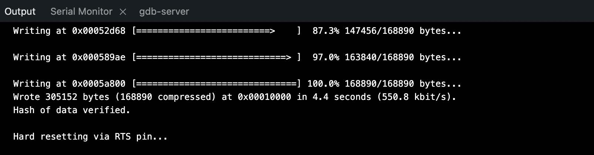

# 📝 Compte Rendu — CEBAN Daniel  
## Séance du 04/11/2025

---

## 🎯 Objectifs de la séance
- Tester le code fourni par l'équipe precedente et vérifier si on arrive à receptioner les messages avec de la carte **ESP32** avec le module **SIM7000G**
- Debuger le code 
- Ameliorer le code existant 

---

## Etapes de la seance 

### Etape 1 : Televersement du code sur la carte ESP32 

Debugger de télecharger le code sur la carte **ESP32 Heltec LoRa**

Le téléversement est le processus qui consiste à compiler le code, le transformer en langage machine, puis à le transférer et l'écrire dans la mémoire flash de l'ESP32.
Une fois cette étape faite, on pourrait démarrer le débogage.


- Lorsqu'on lance le téléchargement, on reçoit une erreur : 

```text
Connecting......................................
A fatal error occurred: Failed to connect to ESP32: Invalid head of packet (0x00): Possible serial noise or corruption.
For troubleshooting steps visit: https://docs.espressif.com/projects/esptool/en/latest/troubleshooting.html
```

  

L'ESP32 doit être mis manuellement en mode flash (ou boot) pour accepter un nouveau programme, bien que de nombreux kits de développement modernes gèrent cela automatiquement via les broches DTR et RTS de l'interface USB-série.
Procédure :

Cliquez sur Téléverser
Attendez que "Connecting..." apparaisse
Maintenez PRG enfoncé
Relâchez PRG lorsque vous voyez des points (....) ou une barre de progression

Même avec cette procédure, on n'arrive pas à télécharger le fichier sur la carte.
On décide alors d'essayer de débrancher tous les câbles de la carte.
Cette fois, le téléversement du code sur la carte **ESP32** non câblée fonctionne.

 

On décide alors qu'il y a un problème de câblage.
Après une analyse, on décide de débrancher le câble **PWRKEY** et de retester, car il était connecté au 3,3 V. Alors que d'apèrs le data sheet elle doit être connecte à une tension <0.5V. On a du faire une erreur lors du câblage
Par la suite on va brancher le **PWRKEY** à un GPIO de commande pour pouvoir le piloter numériquement.

Cette fois ça marche : **on arrive à télécharger le programme sur la carte ESP32 câblée**.

---

### Etape 2 : Débogage série et vérification de la communication série

Étapes pour le Débogage Série :

1. Appuyez sur le bouton RST pour redémarrer l'ESP32.
2. Dans l'IDE Arduino, cliquez sur l'icône de la Loupe (en haut à droite) ou allez dans Outils > Moniteur Série.
3. Vérifiez la vitesse : Assurez-vous que la vitesse sélectionnée en bas du Moniteur Série est bien 115200 baud pour correspondre à votre ligne Serial.begin(115200).

on doit voir le programme s'exécuter et afficher les messages que vous avez codés, par exemple :

```text
Initialisation du modem...
```


#### Résultat 

Erreur du rédemarrage du modem lié à la partie code

```text
rst:0x1 (POWERON_RESET),boot:0x17 (SPI_FAST_FLASH_BOOT)
configsip: 0, SPIWP:0xee
clk_drv:0x00,q_drv:0x00,d_drv:0x00,cs0_drv:0x00,hd_drv:0x00,wp_drv:0x00
mode:DIO, clock div:1
load:0x3fff0030,len:4980
load:0x40078000,len:16612
load:0x40080400,len:3480
entry 0x400805b4
Core dump data check failed:
Calculated checksum='00d9289a'
Image checksum='ffffffff'

Patientez...
Initialisation du modem...
ATE0
AT+CFUN=0
Échec du redémarrage du modem, tentative de continuation sans redémarrage
AT+CGMI
AT+CGMM
Nom du modem : SIMCom SIM7000
ATI
Infos modem : 
AT+CPIN?
```

on cerchant dans le code on trouve la configuration des broches qu'on doit adapter à la nouvelle carte. La le groupe d'avant ont utilisé un autre carte . 


```text
#define UART_BAUD   115200
#define PIN_DTR     25
#define PIN_TX      20
#define PIN_RX      19
#define PWR_KEY     4
```

### Explication RT TX
Initialement on a prevu d'utiliser les pins **GPIO3** et **GPIO1** pour communiquer en sérier 
cependant ce deux pins sont utiliser pour la communication du **EPS32** avec le pc pour le téchechargement des donnes donc on va utiliser d'autres pourt 

on se propose utiliser le pins **21** et **23**


📌 Rôle de PWR_KEY
Pour le modem SIM7000, le rôle de cette broche est de contrôler l'alimentation ou le cycle de réinitialisation du module modem :

Désignation : Le PWR_KEY est destiné à être câblé à la broche PWRKEY du module modem (SIM7000G).

Fonction : Il est utilisé pour envoyer l'impulsion de démarrage ou d'arrêt (l'équivalent d'appuyer et de maintenir le bouton d'alimentation) au modem.

Ancien Câblage : Dans la configuration que vous avez trouvée (avant l'Heltec), la carte ESP32 utilisée précédemment avait désigné le GPIO 4 pour cette tâche.

| Broche de la Fonction | Ancienne Définition (Code) | Nouvelle Définition (Heltec WiFi LoRa 32) |
|----------------------|----------------------------|-------------------------------------------|
| TX (ESP32 -> SIM7000) | PIN_TX 20 | **PIN_TX 23** |
| RX (SIM7000 -> ESP32) | PIN_RX 11 | **PIN_RX 21** |
| Contrôle d'Alimentation | PWR_PIN 4 | **PWR_PIN 13** |
| Vitesse de Communication | UART_BAUD 115200 | **UART_BAUD 115200** |

#### Resultat
Avec cette config on n'arrive non plus a établier une communication serie ESP32 et module GSM. on va donc procede à l'analyse du code et modification...

---


### Etape 3 correction du code

Quelques modification dans le code actuel : 


Redémarrage du modem
```	
if (!modem.restart()) { Serial.println("Échec du redémarrage du modem..."); } 
```

on va utiliser plutôt

```
modem.init();
```
Car modem.restart(); envoie un AT+CFUN=1,1 qui est plus invasif. modem.init() est souvent plus fiable pour initialiser la connexion AT après un cycle de démarrage physique.


#### Resultat 
Même erreur -> possible problème -> mouvais câblage
