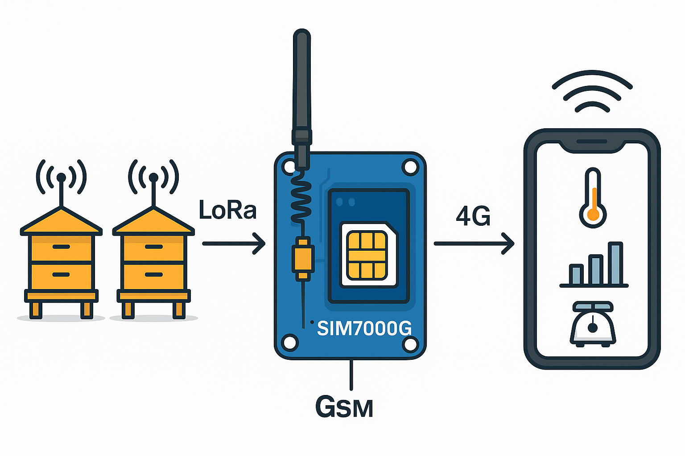

# 📝 Compte Rendu — CEBAN Daniel  
## Séance du 08/10/2025  

### 🧠 Compréhension du projet

Le projet consiste à concevoir une **ruche connectée** capable de collecter et transmettre des données à distance.  
Le système utilise deux technologies principales :

- **LoRa** : module permettant l’envoi de données avec une **très faible consommation d’énergie**, mais un **débit limité**. Il sert à **récupérer les informations** provenant de toutes les ruches.  
- **GSM (SIM7000G)** : module de communication **longue portée**, utilisé pour **transmettre les données** LoRa vers un **téléphone** ou un **serveur en ligne**.

L’ensemble du circuit est alimenté par une **source d’énergie externe de 3.5 V**.

**Exemples de données collectées :**
- Température de la ruche  
- Poids de la ruche  

---

### 🧩 Prise en main du projet précédent

- La carte électronique fabriquée par l’équipe précédente ne sera pas réutilisée, car elle n’est pas fonctionnelle.  
- Nous allons utiliser une breadboard pour réaliser les connexions entre les modules à l’aide de fils.  
  → Cela permettra de tester et valider chaque module séparément avant d’intégrer le tout sur un PCB final.  
- Une partie du code LoRa de l’équipe précédente est disponible dans leur compte rendu.  
- Nous allons nous baser sur leur travail pour avancer plus rapidement et efficacement dans notre propre développement.
- Le code pour la partie GSM étais fonctionnel 

---

### 🚧 Prochaines étapes du projet

1. connecter phisiquement le module ESP32 au SIM7000
2. configurer lo logiciel Arduine 

1. Utiliser le code fournit par l'quipe précedente pour etablier une communication avec le GSM.
     le module ESP32 (qui integre Lora) le connecter à SIM7000G, afin de d'envoier un signal à distance.
2. Implementer la partir LoRa pour recuperer un tramme des donnes.
3. Recevoir et traiter les données (témpérature, poids des ruches) avec LoRa. 

**Outils utilisés :**
- Logiciel : **Arduino IDE**  
- Code source : fourni par l’équipe précédente  

---
