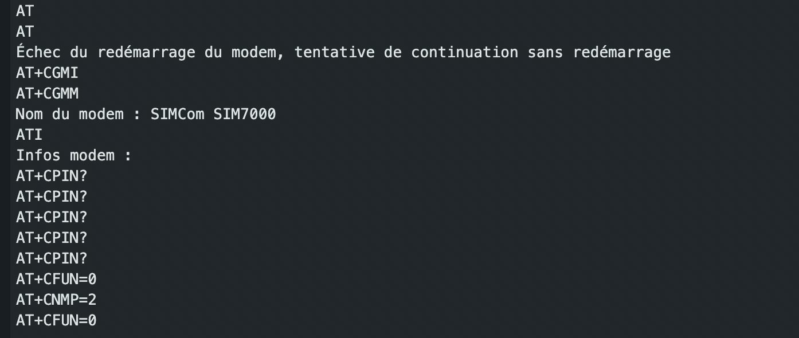
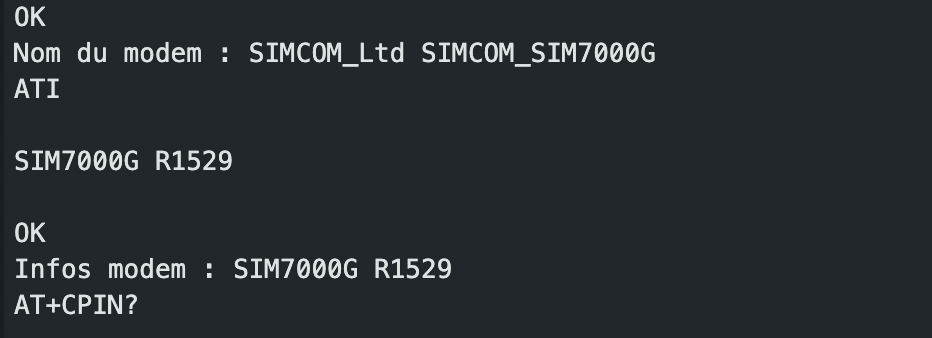
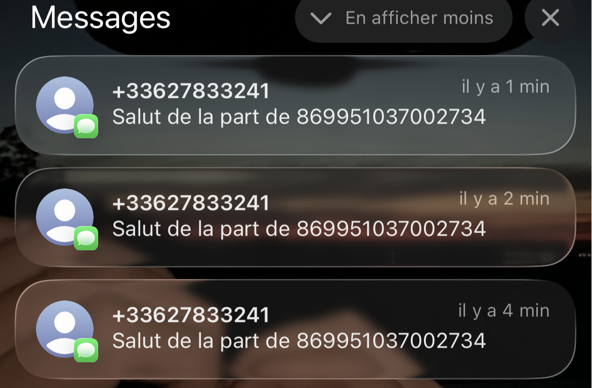

# 📝 Compte Rendu — CEBAN Daniel  
## Séance du 12/11/2025

---

## Problematique 

- Impossible de redemarer le modem de la carte GSM7000 

---

## 🎯 Objectifs de la séance
- Correction du câblage et du code pour pouvoir redemarer et établier la communication **ESP32** avec le module **SIM7000G**
- Ameliorer le code existant 

---

## Etapes de la seance 

### Etape 1 : Recablage 

Le but c'est le trouver les bons pins GPIO pour etablier la communication 


  


Conflit de broches PIN_RX = 21 et PIN_TX = 23.

En regardant le datasheet on utilise broche GPIO21 est directement connectée à OLED_SDA.

Le problème est que GPIO21 est utilisé en interne par la carte pour contrôler l'écran OLED via le protocole I2C.


On va changer à nouveau le broches de PIN_RX et PIN_TX pour utiliser GPIO4 et GPIO17.

La configuration devient 

```
#define UART_BAUD   115200
#define PIN_DTR     25
#define PIN_RX      16   
#define PIN_TX      17  
#define PWR_KEY     13
```


#### Resultat 
**Success** cette fois on arrive a rédemarrer le modem et recevoir certains donnes comme le nom du modem et infos du modem

Ici certains donnes pertinenetes qu'on arrive à extraite vie le **Serial Monitor**

```text
IMEI : 869951037002734
Opérateur : F SFR
IP locale : 3915400804
Qualité du signal : 18
+CPSI: GSM,Online,208-10,0xc29b,16548,87 EGSM 900,-77,0,29-35
GPRS déconnecté
SMS Ready
```

On a aussi une partie qui fait un test **GPRS**

 

```text
---DÉBUT DU TEST GPRS---

Connexion à : sl2sfr
AT+CIPSHUT
```

et on arrive a recevoir un **SMS** sur mon portale personnel

 

On en conclut donc que le code fonctionne. Et maintenant, il faut donc comprendre plus en détail le fonctionnement du code, l'optimiser et essayer d'envoyer des données plus conséquentes.

---

### Etape 2 : Analyse du code

```
modem.sendAT("+CFUN=0 "); //Envoie la commande au modem pour le placer en mode Minimum Functionality 
res = modem.setNetworkMode(2); // mode automatique
modem.sendAT("+CFUN=1 "); //Fonctionnalité Complète
SerialAT.println("AT+CGDCONT?"); // demande de PDP
```

#### Explication des PDP

PDP est un ensemble de paramètres de configuration nécessaires pour établir une connexion de données GPRS/LTE
permet au programmeur de vérifier la configuration réseau avant d’établir une connexion de donnée
il garantit la configuration de l'APN 


**APN** - Access Point Name . C'est un paramètre essentiel qui permet au SIM7000 d'établir une connexion au réseau de données mobiles (GPRS, 3G, 4G, LTE, etc.)

dans notre code on a un bloc de code qui s'assure bien que la configuration APN à été faire et que la connexion au réseau GPRS à été bien établie.


**GPRS** - General Packet Radio Service est une technologie de communication mobile qui représente la 2.5G . Il est considéré comme un service de données par paquets, ce qui signifie qu'il est la première étape dans l'évolution des réseaux mobiles à offrir un accès "toujours connecté" à l'internet .

Caractéristiques
- Efficacité : Les données sont divisées en petits paquets et envoyées uniquement lorsque cela est nécessaire.
- Facturation : La facturation se fait généralement au volume de données transféré
- Toujours Connecté (Always On)
- Débits relativement lents < 171,2 kbps 


On fait la deconnexion du GPRS avant d'envoier le SMS - pourquoi ? 
```
  modem.gprsDisconnect();
  if (!modem.isGprsConnected()) 
  {
    Serial.println("GPRS déconnecté");
  } else 
  {
    Serial.println("Déconnexion GPRS : Échec");
  }

  // --------TEST ENVOI SMS--------
  res = modem.sendSMS(SMS_TARGET, String("Salut de la part de ") + imei);
  DBG("SMS:", res ? "Envoyé" : "Échec");
```

- SMS (Short Message Service) utilise traditionnellement le mode commutation de circuits sur le réseau GSM/2G.

- GPRS (General Packet Radio Service) utilise le mode commutation de paquets pour la transmission de données Internet.

Pourquoi ? 

- Bien que les modems modernes (comme le SIM7000) puissent gérer les deux simultanément dans certaines conditions, de nombreux modems GSM/GPRS plus anciens ou les configurations par défaut requièrent que la couche radio soit dédiée à un seul type de tâche pour la fiabilité. En déconnectant explicitement la session GPRS (paquets), on s'assure que le modem est dans un état optimal pour se concentrer sur l'établissement et l'envoi du message de signalisation SMS.

- Libérer les ressources : Déconnecter le GPRS permet de libérer des ressources internes du modem (mémoire, connexions de données) et l'adresse IP qui lui était allouée.

- Fiabilité de l'envoi : Dans certains cas, tenter d'envoyer un SMS (qui est prioritaire sur les réseaux) pendant qu'une session GPRS est active peut provoquer un conflit ou un échec de l'envoi du SMS. Déconnecter la session GPRS rend le modem plus réactif pour les tâches non-GPRS, comme l'envoi de SMS.


| Caractéristique           | GPRS/LTE (Cellulaire)                                | LoRa (Long Range)                                         |
|----------------------------|------------------------------------------------------|-----------------------------------------------------------|
| **Objectif Principal**     | Accès à l'Internet Public (WAN)                      | Réseau Local et Privé (PAN ou LAN)                        |
| **Couverture**             | Nationale/Mondiale (via opérateurs)                  | Locale (quelques km)                                      |
| **Débit**                  | Moyen à lent (jusqu'à 171 kbps)                      | Très lent (quelques centaines de bits/seconde)            |
| **Rôle dans l'IoT**        | La liaison de retour vers le Cloud/Serveur.          | La liaison de collecte des données des capteurs.          |


Dans l'état actuel de notre code: 

1. Le GPRS est utilisé pour vérifier que le modem est capable d'établir une connexion de données à Internet en utilisant le réseau APN (sl2sfr).

Il obtient les informations :
- l'adresse IP locale
- la qualité du signal (CSQ) 
- le CCID (carte SIM)
- l'opérateur.

Une fois ce information récuperes on peut deconnecter le GPRS pour envoyer le SMS, puis le modem s'éteint.

---

## Etape 3 : Prochaine étape du projet et objectifs 

#### Objectif Integrer LoRa


Objectif 1. Intégration SIM6000 avec le ESP32, connexion à GRSP et envois d'un SMS vers l'utilisateur final → Réussi✅
Objectif 2. Simuler les donnes & envoyer une requête PHP vers un serveur web avec les donnes des ruches. En cours ⏸️ 

- simuler les donnes des ruches numériqument 
- preparer la requete php pour envoyer les donnes vers le site -> http://rucher.polytech.unice.fr/
- vérifier la bonne réception des donnes. 

---

## Etape 4 : Simulation des donnes des ruches via ARDUINO IDE


```
//=========Partie traitement donnes ruches==============

// 1. Structure pour représenter les données d'une ruche
struct rucheData {
  int id;
  float temperature;
  float poids;
};
// declaration de nombre total de ruche
const int  nrRuches = 10;
rucheData ruches[nrRuches]; 

//simuler les donnes 
void simulData(){
  for (int i =0; i<nrRuches; i++){
      ruches[i].id = i+1;
      ruches[i].temperature = random(0, 400) / 10.0; // du 0 à 40;
      ruches[i].poids= random(100000, 400000) / 10.0; // du 10kg à 30 kg
  }
}

String serializeData() {
  String payload = "[";
  for (int i = 0; i < nrRuches; i++) {
    payload += "{";
    payload += "\"id\":" + String(ruches[i].id) + ",";
    payload += "\"temp\":" + String(ruches[i].temperature) + ",";
    payload += "\"weight\":" + String(ruches[i].poids);
    payload += "}";
    if (i < nrRuches - 1) {
      payload += ",";
    }
  }
  payload += "]";
  return payload;
}
//======================================================
```

## Etape 5 : envoi du requete PHP vers le site 

pour envoier la requete PHP ver le site on utilise le **GPRS** qui est utilisé pour la communication WEB et le IOT


**GPRS** c'est le protocole qui nous permet d'envoyer des requetes sur internet 

**le site HTTP(S)** est le site sur lequel on doit envoyer les donnes qu'on doit se connecter **via une adresse IP que le GPRS nous la donne une fois connecté**

On va utiliser une requete HTTP(S) qui peut être du type
- Post pour envoyer les donnes au serveur 
- Get pour recevoir les donnes du serveur. dans notre cas on peut envisager de recevoir une réponse du serveur une fois toues les donnes récues par le site.


LA SUITE : faire la requete HTTPS et l'envoier via le GPRS vers le site HTTP


