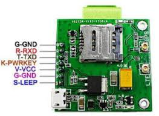
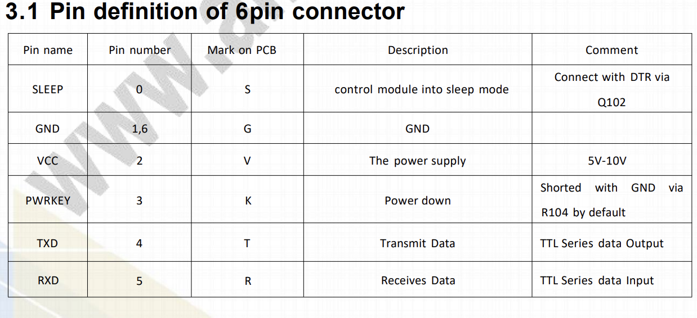

# 📝 Compte Rendu — CEBAN Daniel  
## Séance du 23/10/2025

---

## 🔧 Outils utilisés
- **ESP32 Heltec LoRa** – Microcontrôleur principal du système.  
- **SIM7000G** – Module GSM / NB-IoT / LTE pour la communication mobile.  
- **Arduino IDE** – Logiciel de programmation pour cartes électroniques, utilisé pour programmer l’ESP32.

---

## 🎯 Objectifs de la séance
- Connecter le module **ESP32** au module **SIM7000G** et établir la communication entre les deux avec le code fourni par l’équipe précédente.  
- Tester et améliorer le code existant.  
- Comprendre le fonctionnement des bibliothèques utilisées et optimiser l’usage du modem.

---

## ⚡ Étapes de la séance

### 1. Câblage ESP32 ↔ SIM7000G
Il est essentiel de bien connecter les broches **RX/TX** entre l’ESP32 et le module SIM7000G.  
> ⚠️ Sur le module BK-SIM7000G, les connexions RX et TX doivent être inversées par rapport à l’ESP32 (principe de communication série).  

Le **PWRKEY** du SIM7000G doit également être connecté pour permettre l’allumage et l’extinction du module.

D'après le DATASHEET du 7000G

PWRKEY 
- Default status : DI,P
- Description :System power on/off control nput, active low. The efficient input level must be below 0.5V.
- Comment - The level is 0.8V when this PIN is floating; 


Explication : 
Par défaut, le PWRKEY est considéré HIGH lorsqu’il n’est pas connecté (flottant). Le module reste éteint.
Pour allumer le module, il faut tirer la broche LOW (~0 V) pendant ~1 seconde, puis la relâcher (retour à HIGH).
Pour l’éteindre, même principe : on met LOW pendant ~1 seconde.

le SIM7000G a une résistance internet qui permet d'avor un tension petite <0.5V à la broche PWRKEY

Donc on va le brancher à la broche 3,3 pour pouvoir agir dessus

par la suite dans notre code on va afaire démarrer le modem en utlisant le PWRKEY en lui donnat une impulsion pendant 300ms

```
pinMode(PWR_PIN, OUTPUT);
digitalWrite(PWR_PIN, HIGH);
delay(300);
digitalWrite(PWR_PIN, LOW);
```


  



---

### 2. Importation et compréhension du code dans Arduino IDE
Le code fourni par l’équipe précédente utilise la bibliothèque **TinyGSM**, qui simplifie grandement la communication avec le modem.  

#### La bibliothèque TinyGSM
- Permet d’établir des connexions GPRS / LTE.  
- Permet l’envoi et la réception de SMS.  
- Permet de passer des appels (selon le module).  
- Optimisée pour les cartes à faible mémoire comme l’ESP32.  

#### Structure du code
a. **Configuration et initialisation du modem**

define TINY_GSM_MODEM_SIM7000
define TINY_GSM_RX_BUFFER 1024
define SerialAT Serial1
define DUMP_AT_COMMANDS
define GSM_PIN ""
define SMS_TARGET "+33645218132"

b. **parametre réseau** 

const char apn[] = "sl2sfr";
const char gprsUser[] = "";
const char gprsPass[] = "";

c. **Initialisation du modem**

SerialAT.begin(UART_BAUD, SERIAL_8N1, PIN_RX, PIN_TX);
modem.restart(); // redémarrage du modem pour assurer un état propre

d. **Choix des modes réseau** 

modem.sendAT("+CFUN=0");      // Désactive temporairement le modem
modem.setNetworkMode(2);      // Mode automatique
modem.setPreferredMode(1);    // Priorité au mode CAT-M
modem.sendAT("+CFUN=1");      // Réactive le modem

e. **Connexion GPRS et envoi de SMS**

modem.gprsConnect(apn, gprsUser, gprsPass);
modem.sendSMS(SMS_TARGET, String("Hello from ") + imei);

f. **Mode sommeil profond**

modem.poweroff();
esp_deep_sleep_start();

Permet d’éteindre le modem et mettre l’ESP32 en sommeil pour économiser l’énergie.

---

### 3. Téléchargement et test du code

- Importer le code dans Arduino IDE.
- Installer les bibliotheques necessaires
- Programmer l’ESP32 et tester la communication avec le SIM7000G.

---

### 4. Analyse et correction du code

Identifier les erreurs ou parties à améliorer.

Adapter les paramètres réseau ou les pins si nécessaire.

Optimiser la gestion de l’énergie (mode sommeil profond).


---

### Conclusion

La bibliothèque TinyGSM est essentielle pour simplifier la communication UART avec le SIM7000G.

Le câblage RX/TX et PWRKEY est crucial pour le bon fonctionnement du module.

La mise en sommeil profond permet d’économiser l’énergie lors des phases d’inactivité.