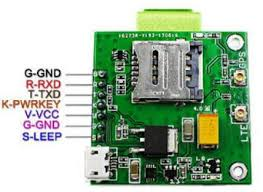
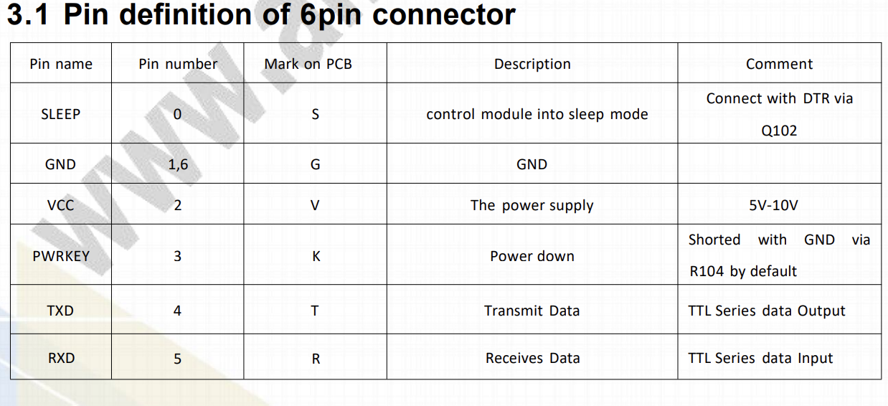

# 📝 Compte Rendu — CEBAN Daniel  
## Séance du 23/10/2025 

---

## Outils 
- **ESP32 Heltec LoRa** – Microcontrôleur principal du système.  
- **SIM7000G** – Module GSM / NB-IoT / LTE pour la communication mobile.  
- **Adruino** IDE - logiciel de programmation de cartes électroniques (on va l'utiliser pour programmer la carte ESP32)

---

# Objectifs séance
 - Cabler le module **ESP32** avec le module **SIM7000G** et établier la communication entre le deux en utilisant le code déjà fourni par l'équipe precedente.
 - tester et améliorer le code

 ---

# ETAPES : 
## 1. Faire la cablage entre ESP32 & SIM7000G

"Il est essentiel, lors de l’utilisation de ce code, de prêter une attention particulière aux connexions RX/TX, qui doivent être reliées correctement aux broches GPIO de l’ESP32. Il convient également de noter que, sur le module BK-SIM7000G, les connexions RX et TX doivent être inversées par rapport à celles de l’ESP32, conformément au principe de communication série"

le PWRKEY de la carte SIM700G doit être connecte ???

---

## 2. Importation du code dans le logiciel Arduino IDE & comprehension du code.

D'après le rapport de l'équipe precedente le code founir doit marche avec le module ESP32 & SIM7000G 
Ils ont utlise une biliotheque TinyGSM qui permet de simplifier le code, car certains fonctionalités sont déjà codées.

### la bibliotèque Tiny GSM
La bibliothèque TinyGSM permet d’abstraire une grande partie de cette complexité en offrant une interface plus intuitive et orientée objet pour communiquer avec le modem. TinyGSM est également optimisée pour fonctionner sur des cartes à faible mémoire ce qui correspond à notre cas.

Grâce à TinyGSM, il est possible de :
- Établir des connexions GPRS (données mobiles)
- Envoyer et recevoir des SMS
- Passer des appels téléphoniques (selon le module utilisé)
- ...

### Explication du cede

Dans le code on trouve plusiers parites :
1. configuration, initialisation du modem
2. choix des modes réseau
3. test de la connexion GPRS, et envoi de SMS. 

## 3. Télécharger le le code de l'équipe d'avant de le faire marche sur la carte 
---
## 4. analyse et corriger le code 

---

## Concluison
- On va utliser les biblioteques TinyGSP pour établier une communication série (UART) (Pins RX & TX) avec nos composants. Cette partie va nous permetre ...
- 

---

## Anexe Images 

