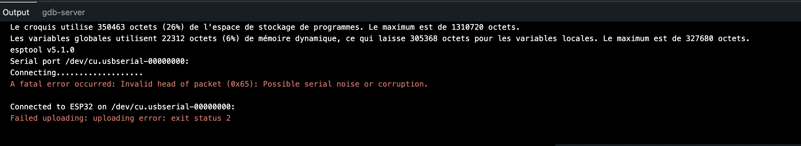
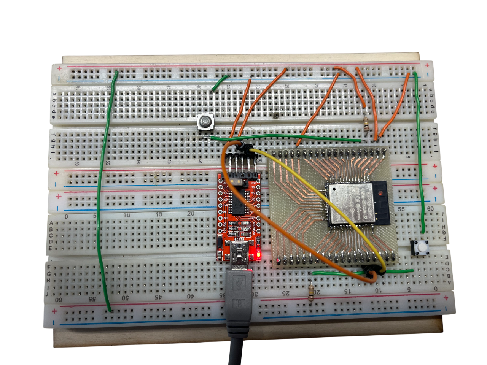

# 📝 Compte Rendu — CEBAN Daniel  
## Séance 10 du 03/02/2026 

---

## 🔴 Problématique rencontrée lors de la dernière séance 
On n'arrive plus à faire télécharger du code sur le module **ESP32** même en faisant le câblage avec le module ESP32 seul 


## 🎯 Objectif de la séance 
⚠️ Comprendre pourquoi le module ESP32 ne fonctionne plus ?
- Problème du câblage ? 
- Module défectueux ? 
- Mauvaise manipulation des boutons. 
Ajouter le module LoRa et vérifier l'intégralité du montage 


## 📋 Étapes de la séance 


### Étape 1 : Vérification de la carte ESP32 🔍

Après recâblage on retrouve une autre erreur de téléversement 



On a retesté avec la bonne séquence d'appuyer sur le bouton et cette fois ça marche 

1. Appuyer sur le bouton téléverser le programme
2. Maintenir le bouton RST enfoncé 
3. Lorsque on voit le message "Connecting..." En maintenant le bouton RST appuyer sur le bouton PRG pour une courte période 
4. Relâcher les deux boutons 


Voici le câblage actuel :

| Composant | Départ | Arrivée | Note |
| --- | --- | --- | --- |
| Alimentation | Sortie 3.3V de l'USB | Broche 2 (3V3) | JAMAIS de 5V sur cette broche ! |
| Masse | GND de l'USB | Broche 1 (GND) |  |
| Série TX | TX de l'USB | Broche 40 (RXD0) | Inversion standard (TX vers RX) |
| Série RX | RX de l'USB | Broche 41 (TXD0) | Inversion standard (RX vers TX) |
| Pull-up EN | Broche 9 (EN) | 3.3V | Via ta résistance $100k\Omega$ |
| Pull-up GPIO0 | Broche 23 (GPIO0) | 3.3V | Via ta résistance $100k\Omega$ |





```text
rst:0x1 (POWERON_RESET),boot:0x13 (SPI_FAST_FLASH_BOOT)
configsip: 0, SPIWP:0xee
clk_drv:0x00,q_drv:0x00,d_drv:0x00,cs0_drv:0x00,hd_drv:0x00,wp_drv:0x00
mode:DIO, clock div:1
load:0x3fff0030,len:4980
load:0x40078000,len:16612
load:0x40080400,len:3480
entry 0x400805b4
=======================================
   TEST DIAGNOSTIC ESP32 REUSSI !
=======================================
Frequence CPU : 240 MHz
L'ESP32 tourne depuis : 0 secondes.
L'ESP32 tourne depuis : 1 secondes.
```


### Étape 2 : Connecter le module LoRa

On a câblé le module LoRa et exécuté un code qui peut vérifier que l'ESP32 est bien relié à un module LoRA.

Voici le code qui permet de vérifier si le module LoRa est bien connecté.

```cpp
#include <RadioLib.h>
// NSS: 5, DIO1: 34, NRST: 27, BUSY: 35
LLCC68 radio = new Module(5, 34, 27, 35);

void setup() {
  Serial.begin(115200);
  delay(2000); // Laisse le temps au port série de s'ouvrir

  Serial.println(F("\n--- Test de communication ESP32 <-> LoRa CC68 ---"));
  Serial.print(F("[LLCC68] Initialisation... "));
  int state = radio.begin(868.0);

  if (state == RADIOLIB_ERR_NONE) {
    Serial.println(F("SUCCÈS !"));
    Serial.println(F("Le module LoRa répond et le câblage SPI est correct."));
  } else {
    Serial.print(F("ÉCHEC. Code erreur : "));
    Serial.println(state);
    
    // Aide au diagnostic
    if (state == -2) Serial.println(F("Erreur: Le module ne répond pas"));
    if (state == -70) Serial.println(F("Erreur: Broche BUSY bloquée. Vérifiez le GPIO 35."));
    
    while (true); // Bloque ici si ça ne marche pas
  }
}
```


Erreur lors de l'exécution du code
```text
configsip: 0, SPIWP:0xee
clk_drv:0x00,q_drv:0x00,d_drv:0x00,cs0_drv:0x00,hd_drv:0x00,wp_drv:0x00
mode:DIO, clock div:1
load:0x3fff0030,len:4980
load:0x40078000,len:16612
load:0x40080400,len:3480
entry 0x400805b4

--- Test de communication ESP32 <-> LoRa CC68 ---
[LLCC68] Initialisation... ÉCHEC. Code erreur : -2
Erreur: Le module ne répond pas. Vérifiez le câblage et l'alimentation 3.3V.

```


### Problematique 
Le code toujours = -2 
ce qui signifique que le module ESP32 ne trouve pas le module LoRa
Tension qui arrive sur module LoRa = **2.9 V** (pas assez ? )

#### Solutions possibles 

1. On va connecter les 2 autres messes du module LoRa à la masse communice pour être sûr 
2. On va founir la tension 3.3 V à partir d'un générateur de tension stable. pour être sûr qu'on a du 3.3V sur le LoRa est le module ESP32.

3. Si ca ne fonctionne pas on va alors ajouter des condensateurs de découplage.