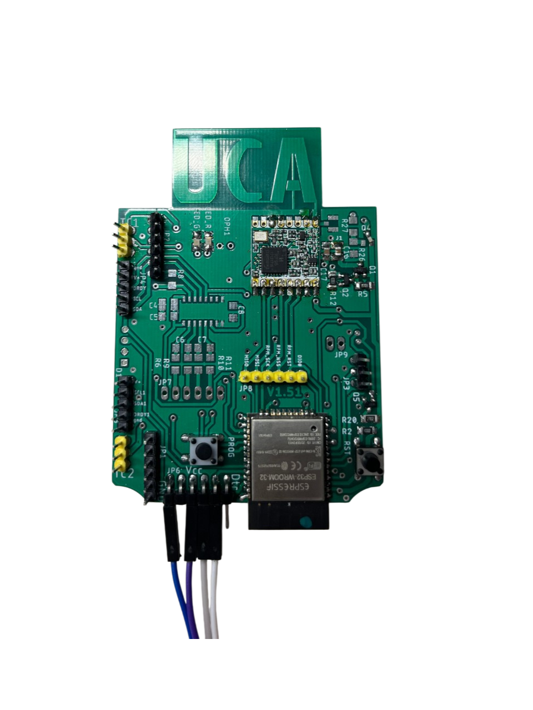

# 📝 Compte Rendu — CEBAN Daniel  
## Séance 13 du 5/03/2026 


---

## Problématique 
On n'arrive pas à communiquer avec le module LoRa en utilisant la librairie  **<RadioLib.h>**

---

## Objectifs

1. Changer le module **LoRa-CC68-868 G-NiceFR** et utiliser la bibliothèque **<LoRa.h>** 


2. Integration du module SIM7000G avec ESP32 nu


### Etape 1. coder avec la bibliothèque <LoRa.h>
On va utiliser la fonction **begin(long frequency)** pour initialiser la communication avec le module LoRa

```cpp
int LoRaClass::begin(long frequency)
{
#if defined(ARDUINO_SAMD_MKRWAN1300) || defined(ARDUINO_SAMD_MKRWAN1310)
  pinMode(LORA_IRQ_DUMB, OUTPUT);
  digitalWrite(LORA_IRQ_DUMB, LOW);

  // Hardware reset
  pinMode(LORA_BOOT0, OUTPUT);
  digitalWrite(LORA_BOOT0, LOW);

  pinMode(LORA_RESET, OUTPUT);
  digitalWrite(LORA_RESET, HIGH);
  delay(200);
  digitalWrite(LORA_RESET, LOW);
  delay(200);
  digitalWrite(LORA_RESET, HIGH);
  delay(50);
#endif

  // setup pins
  pinMode(_ss, OUTPUT);
  // set SS high
  digitalWrite(_ss, HIGH);

  if (_reset != -1) {
    pinMode(_reset, OUTPUT);

    // perform reset
    digitalWrite(_reset, LOW);
    delay(10);
    digitalWrite(_reset, HIGH);
    delay(10);
  }

  // start SPI
  _spi->begin();

  // check version
  uint8_t version = readRegister(REG_VERSION);
  if (version != 0x12) {
    return 0;
  }

  // put in sleep mode
  sleep();

  // set frequency
  setFrequency(frequency);

  // set base addresses
  writeRegister(REG_FIFO_TX_BASE_ADDR, 0);
  writeRegister(REG_FIFO_RX_BASE_ADDR, 0);

  // set LNA boost
  writeRegister(REG_LNA, readRegister(REG_LNA) | 0x03);

  // set auto AGC
  writeRegister(REG_MODEM_CONFIG_3, 0x04);

  // set output power to 17 dBm
  setTxPower(17);

  // put in standby mode
  idle();

  return 1;
}
```

#### Résultat : Echec 

on remarque dans le code de la bibliotheque LoRa que si la version du module n'est pas la 12 le code va toujours retourner la valeur 0 

```cpp
if (version != 0x12) {
    return 0;
  }
```

On va utiliser un code pour diagnostiquer la version actuelle du notre module 

```cpp
  digitalWrite(LORA_NSS, LOW);
  SPI.transfer(0x42 & 0x7F); // Adresse de lecture pour SX127x
  uint8_t version = SPI.transfer(0x00);
  digitalWrite(LORA_NSS, HIGH);
  Serial.print("Réponse du registre 0x42 (Version) : 0x");
  Serial.println(version, HEX);
```

#### Résultats de la version : 
```text
--- Diagnostic du module LoRa ---
Réponse du registre 0x42 (Version) : 0xAA
```
#### Conclusion 
1. La réponse du registre nous permet de dire qu'on arrive bien à communiquer avec le module 
2. La version 0xAA nous permet pas de communiquer avec le module LoRa (car le code nécessite la version 0x12)


### Etape 2
Utilisation d'une carte qui integre le module **EPS32** nu et le module **RF96** on va utiliser une connecteur UART pour tester la carte 




### remarque 
on doit déclarer le GPIO13 en sortie et le mettre à HIGH

voici le code qu'on utiliser pour tester la nouvelle carte 

```cpp
#include <LoRa.h>
// Définition des broches selon votre montage
#define SCK     18
#define MISO    19
#define MOSI    23
#define NSS      5
#define RST     27
#define DIO0    34

#define ENABLE 13
void setup() {
  Serial.begin(115200);
  while (!Serial);
   pinMode(ENABLE, OUTPUT);
  digitalWrite(ENABLE, HIGH);
  LoRa.setPins(NSS, RST, DIO0);
  // 2. Initialiser la fréquence (868 MHz pour l'Europe)
  if (!LoRa.begin(868E6)) {
    Serial.println(F("ÉCHEC ! Le module ne répond pas. Vérifiez le câblage SPI."));
    while (1);
  }
  Serial.println("Succes");
}
```

### resultat 
```text
mode:DIO, clock div:1
load:0x3fff0030,len:4980
load:0x40078000,len:16612
load:0x40080400,len:3480
entry 0x400805b4
E BOD: Brownout detector was triggered
```

#### interprétation 
ESP32 redémarre parce que la tension chute brutalement
#### solution 
Brancher la carte sur une alimentation fixé qui va livrer une ampérage plus importante


#### Resultat BINGO!!!

```text
rst:0x3 (SW_RESET),boot:0x12 (SPI_FAST_FLASH_BOOT)
configsip: 0, SPIWP:0xee
clk_drv:0x00,q_drv:0x00,d_drv:0x00,cs0_drv:0x00,hd_drv:0x00,wp_drv:0x00
mode:DIO, clock div:1
load:0x3fff0030,len:4980
load:0x40078000,len:16612
load:0x40080400,len:3480
entry 0x400805b4
Succes

```


### Etape 4. plan d'action

le but étant de faire fonctionner le composant LoRA-CC68. Avec la carte précédente on a vu qu'on peut utiliser le module <LoRa.h> pour faire fonctionner un module LoRa cependant il est compatible seulement avec une puce de version 0x12. Or notre carte a une version 0xAA. 

Par la suite on va donc revenir à la bibliothèque <RadioLib.h> plus complète et plus bavarde (nous indique les codes erreurs). On va donc essayer de faire fonctionner le composant LoRA-CC68 avec l'ancien brochage.


### Etape 5. retester l'ancien câblage avec Module LoRA et ESP32

```text
=== LLCC68 Init Test (XTAL mode) ===
Pins: NSS=5 DIO1=34 NRST=27 BUSY=35
Initial BUSY state: 0
[LLCC68] begin() returned: -707
FAILED – code -707
```

Toujours la même erreur on arrive à detecter le moduole mais on ne recoit aucune réponse (erreur 707) 

Investigation par la suite... 

### Etape 3. Integration du module SIM 7000G avec l'ESP32 nu 

Schéma de connexion (Câblage UART). Le SIM7000G communique SPI

| SIM7000G Pin | ESP32 GPIO | Fonction | Note |
|---|---|---|---|
| VCC | 5V / VIN | Alimentation | Attention : Doit fournir 2A en pointe ! |
| GND | GND | Masse commune | Indispensable pour la communication. |
| TX | GPIO 16 (RX2) | Données SIM -> ESP | |
| RX | GPIO 17 (TX2) | Données ESP -> SIM | |
| PWRKEY | GPIO 4 | Allumage | Nécessite une impulsion basse pour démarrer. |