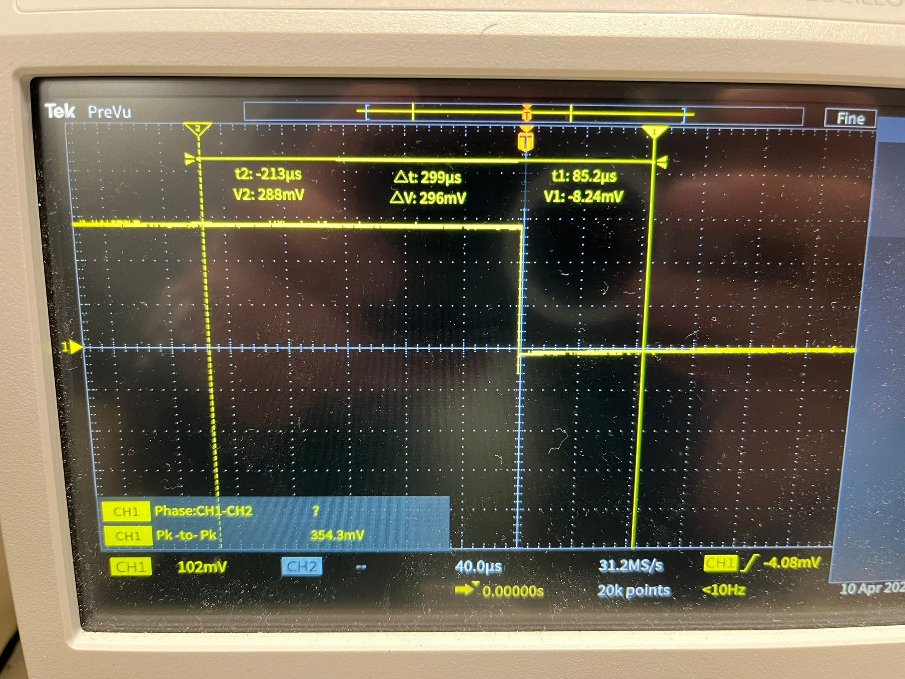

# 📝 Compte Rendu — CEBAN Daniel  
## Séance 16 du 10/04/2026


## objectifs de la séance 


1. Réveiller l'ESP32 lorsque LoRa réceptionne un message
2. Intégration du module SIM7000 au reste du montage


## Étapes de la séance : 

## Etape 1 : réveil via DIO1 

Le problème, c'est qu'après endormissement, l'ESP32 ne se réveille jamais.
```text

LoRa initialized SUCCESSFULLY!
Listening... ESP32 will sleep after 10s of inactivity

[INFO] 10 seconds inactivity → Entering Deep Sleep...
```

On va changer le mode d'endormissement 

On va passer en deep sleep mode 
```cpp
esp_sleep_enable_ext0_wakeup((gpio_num_t)LORA_DIO1, HIGH);
esp_deep_sleep_start();             // L'ESP32 s'endort ici
```
Au light sleep mode 

```cpp
esp_sleep_enable_gpio_wakeup();
gpio_wakeup_enable((gpio_num_t)LORA_DIO1, GPIO_INTR_HIGH_LEVEL);
esp_light_sleep_start();
```


### problème numéro 1 

La ligne int rxState = radio.receive(received); est bloquante.
Par défaut, cette fonction attend qu'un paquet arrive ou qu'un "timeout" interne survienne (souvent plusieurs secondes). Tant que cette fonction n'a pas fini, ton test if (millis() - lastRxTime >= INACTIVITY_TIMEOUT) n'est jamais exécuté. Le processeur est "coincé" dans la lecture radio au lieu de vérifier le chrono.

### solution 
```cpp
  int rxState = radio.receive(received, 0); // 0 time interrupt
```

### problème numéro 2 

Le problème : Les GPIO 34, 35, 36 et 39 de l'ESP32 sont des entrées seules qui n'ont pas de résistances de pull-down internes.

Conséquence : Ta pin est "flottante"
### Solution 
```cpp
#define LORA_NSS 5
#define LORA_DIO1 32  
#define LORA_NRST 27
#define LORA_BUSY 33  
```

### Résultat -> toujours pas de réveil avec LoRa


## Etape 2 : 

On va forcer le pin DIO1 à HIGH avec un câble pour tester si une impulsion sur ce pin réveille bien le module ESP32

Et on arrive à réveiller l'ESP32 avec une impulsion sur le pin GPIO32 (DIO1) 
Donc le problème, c'est le module LoRa qui n'envoie pas d'impulsion sur le DIO1 lors de la réception du message
```text
=== MESSAGE RECEIVED ===
Msg : Hello from Heltec #138 - 2070s
RSSI: -83.00 dBm
SNR : 10.75 dB

[INFO] 10 seconds inactivity → Entering Deep Sleep...

Waked-up after a light sleep!!!

=== MESSAGE RECEIVED ===
Msg : Hello from Heltec #138 - 2070s
RSSI: -83.00 dBm
SNR : 10.75 dB
```

## Etape 3 : Visualiser les signaux à l'aide de l'oscilloscope


1. En visualisant le pin DIO1 de la LoRa sur l'oscilloscope lors de la transmission du message, on remarque qu'il n'y a aucune variation de la tension. Ce qui explique le problème, puisque l'on s'attendait à avoir une interruption sur le DIO1 pour réveiller l'ESP32.

3. Visualisation du pin BUSY sur l'oscilloscope : et cette fois, on voit bien une variation du signal lors de la réception du message. 





DIO1 (Le signal d'événement) : C'est le seul pin capable de signaler une réception de paquet (RxDone). S'il ne bouge pas, ce n'est pas parce qu'il est défectueux, c'est parce que le module n'a pas reçu l'ordre de mapper l'interruption sur ce pin.

Le danger : Utiliser BUSY pour réveiller l'ESP32 ne marchera pas en mode sommeil car, sans activité SPI de l'ESP32, le module n'a aucune raison de passer en état "Busy" (occupé), même s'il reçoit un signal radio.

## Etape 4 : 

1. Quand l’ESP32 est éveillé → le module LoRa montre des variations sur BUSY lors de la réception → tout va bien.
2. Après 10 secondes → l’ESP32 entre en sommeil.
3. Une fois l’ESP32 endormi → plus aucune variation sur BUSY, même si tu envoies un message depuis l’autre module.

-> Le module LoRa perd (ou met en pause) sa configuration lorsque l’ESP32 est en Deep Sleep / Light Sleep.


### Conclusion 

En fait, on a oublié de calibrer le pin DIO1

et d'activer l'interruption 

```cpp

radio.startReceive(RADIOLIB_SX126X_RX_TIMEOUT_INF);
```


## Etape 5 : BINGO!!!

En modifiant le code, on arrive bien à endormir et réveiller l'ESP32 lors de la réception d'un message


```text

=== MESSAGE RECEIVED ===
Msg : Hello from Heltec #64 - 640s
RSSI: -82.00 dBm
SNR : 10.25 dB

[INFO] Inactivité -> Nettoyage et Sommeil...
ESP32 part en sommeil léger. DIO1 devrait rester à 0V...

[SYSTEM] RÉVEIL DÉTECTÉ !

=== MESSAGE RECEIVED ===
Msg : Hello from Heltec #65 - 650s
RSSI: -80.00 dBm
SNR : 10.50 dB
```


Le module LoRa n'était pas correctement configuré juste avant la mise en sommeil de l'ESP32. Plus précisément, le mappage de l'interruption de réception n'était pas forcé sur la pin physique DIO1. De plus, sans un paramètre de timeout infini, le module cessait d'écouter ou levait une erreur de timeout avant l'arrivée d'un message. Résultat : aucune impulsion n'était envoyée sur DIO1 lors de la réception d'un paquet, et l'ESP32 ne recevait jamais le signal électrique nécessaire pour se réveiller


Il est crucial de forcer le signal DIO1 à 0 (état bas) avant l'endormissement (via une commande standby ou un nettoyage des interruptions). Si DIO1 est déjà à 1 au moment où l'ESP32 s'endort, celui-ci ne pourra pas détecter le front montant (le passage de 0 à 1) provoqué par un nouveau message, rendant le réveil impossible.

### Liste de corrections 

1. Mapping matériel : Obligation de lier l'événement "Message reçu" à la broche physique DIO1 avant de couper le SPI.

2. Écoute permanente : Utilisation du mode RX Infini pour éviter que le module ne lève un "faux" signal de timeout qui saturerait la pin.

3. État de repos : Garantie que DIO1 est bien à 0V au repos pour que l'impulsion de 3.3V soit détectable par l'ESP32 comme un événement de réveil.

#### Le code qui fonctionne pour la mise en sommeil 

```cpp
 if (millis() - lastRxTime >= INACTIVITY_TIMEOUT) 
  {
    Serial.println("\n[INFO] Inactivité -> Nettoyage et Sommeil...");
    
    // 1. On s'assure que DIO1 est bien à 0 avant de partir
    radio.standby(); 
    radio.clearDio1Action(); // On enlève l'action actuelle

    // 2. On reconfigure DIO1 pour qu'il ne réagisse QU'AU MESSAGE reçu
    // On ne passe PAS de fonction callback ici pour éviter les conflits au réveil
    // On demande au module de rester en RX permanent
    radio.startReceive(RADIOLIB_SX126X_RX_TIMEOUT_INF);

    delay(100);
    Serial.flush();

    // 3. Configuration du réveil ESP32
    esp_sleep_enable_gpio_wakeup();
    gpio_wakeup_enable((gpio_num_t)LORA_DIO1, GPIO_INTR_HIGH_LEVEL);

    Serial.println("ESP32 part en sommeil léger. DIO1 devrait rester à 0V...");
    esp_light_sleep_start();

    // --- AU RÉVEIL ---
    Serial.println("\n[SYSTEM] RÉVEIL DÉTECTÉ !");
    // On remet l'action pour le loop
    radio.setDio1Action(onPacketReceived); 
    lastRxTime = millis();
  }
```

## Tableau récapitulatif de connectivité (pratique)

| Composant A | Pin A | Composant B | Pin B | Interface |
|---|---|---|---|---|
| ESP32 WROOM | GPIO23 | LoRa LLCC68 | MOSI | SPI |
| ESP32 WROOM | GPIO19 | LoRa LLCC68 | MISO | SPI |
| ESP32 WROOM | GPIO18 | LoRa LLCC68 | SCK | SPI |
| ESP32 WROOM | GPIO5 | LoRa LLCC68 | NSS/CS | SPI |
| ESP32 WROOM | GPIO27 | LoRa LLCC68 | NRST | Contrôle |
| ESP32 WROOM | GPIO32 ou GPIO34 ou GPIO36 | LoRa LLCC68 | DIO1 | IRQ / réveil |
| ESP32 WROOM | GPIO33 ou GPIO35 (tests aussi 36/39/32/25) | LoRa LLCC68 | BUSY | État module |
| ESP32 WROOM | GPIO17 (TX) | SIM7000 | RX | UART |
| ESP32 WROOM | GPIO16 (RX) | SIM7000 | TX | UART |
| ESP32 WROOM | GPIO13 ou GPIO4 | SIM7000 | PWRKEY | Contrôle alim |
| ESP32 WROOM | GPIO25 | SIM7000 | DTR | Gestion modem |
| ESP32 WROOM | 5V/VIN et GND | SIM7000 | VCC et GND | Alimentation |
| ESP32 WROOM | 3.3V et GND | LoRa | VCC et GND | Alimentation |


## Prochain objectif 

1. Nettoyer le code
2. Essais avec le mode **deep sleep** (actuellement on est en mode light_sleep)
2. intégrer le SIM7000G au reste du montage pour faire la chaîne de communication complète