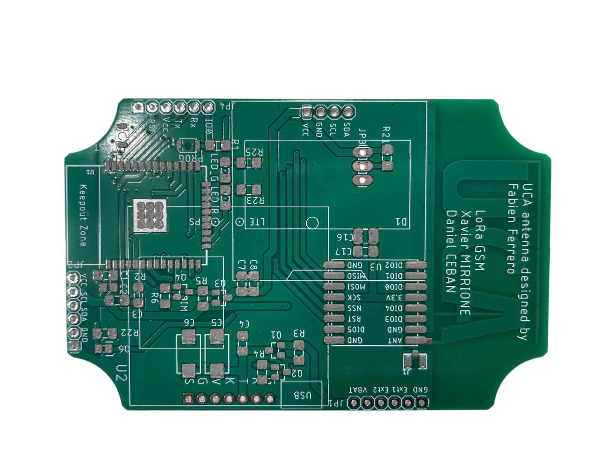
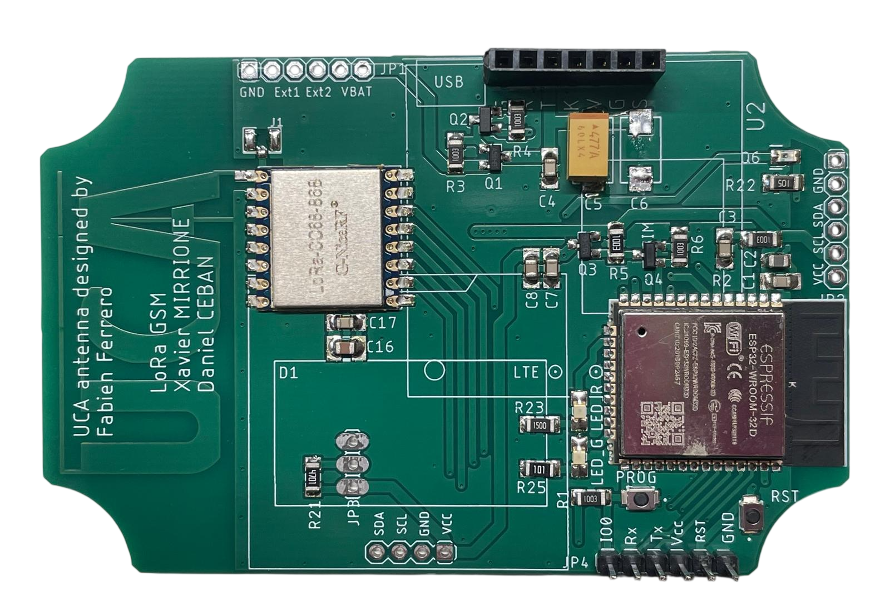
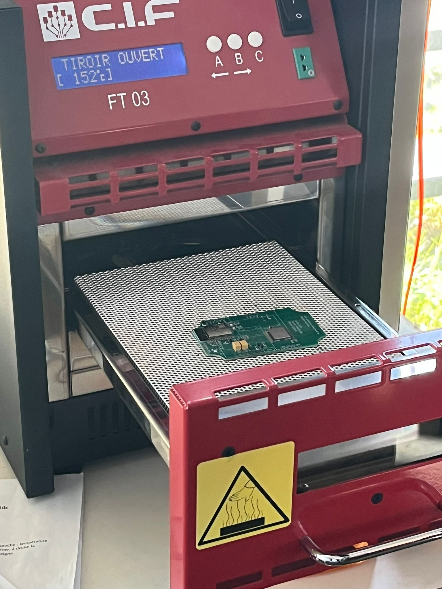
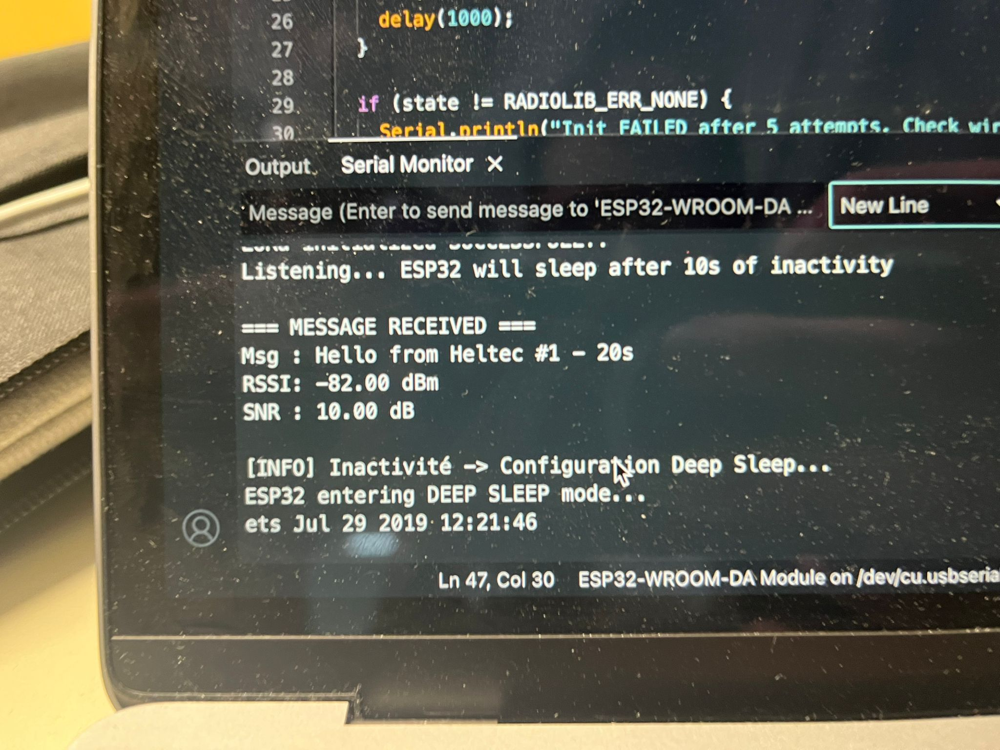

# 📝 Compte Rendu — CEBAN Daniel  
## Séance 18 du 24/04/2026


## Objectifs de la séance 

1. Nettoyer le code.
2. Essais avec le mode **deep sleep** (actuellement on est en mode light_sleep).
3. Intégrer le module SIM7000G au reste du montage pour faire la chaîne de communication complète.
4. Test avec la connexion 4G/GSM.


## Étapes de la séance 


## Étape 1 : Test en mode Deep Sleep
Antérieurement nous avons testé le mode `light_sleep`. Maintenant, nous allons passer au mode `deep_sleep` pour économiser davantage d'énergie lors de l'endormissement. On se rapproche ainsi de l'objectif final du projet (optimisation maximale de la consommation).

Lors de la configuration du deep sleep, nous rencontrons un problème :

```text
=== ESP32 <-> LoRa LLCC68 - Wake-up   ===

begin() attempt 1 = -707
begin() attempt 2 = 0
LoRa initialized SUCCESSFULLY!
Listening... ESP32 will sleep after 10s of inactivity

[INFO] Inactivité -> Configuration Deep Sleepou...
ESP32 entering DEEP SLEEP mode... 
ets Jun  8 2016 00:22:57

rst:0x5 (DEEPSLEEP_RESET),boot:0x13 (SPI_FAST_FLASH_BOOT)
configsip: 0, SPIWP:0xee
clk_drv:0x00,q_drv:0x00,d_drv:0x00,cs0_drv:0x00,hd_drv:0x00,wp_drv:0x00
mode:DIO, clock div:1
load:0x3fff0030,len:4744
load:0x40078000,len:15672
```
Lorsque l'ESP32 passe en mode deep sleep, sa sortie de veille effectue un redémarrage (*reboot*) complet. Le message qui a permis de réveiller l'ESP32 n'est donc pas interprété par celui-ci pendant qu'il boot, il est donc perdu. 


**Solution** : Configurer l'autre nœud LoRa (le module HELTEC) pour envoyer un message de réveil (*wake-up*) qui ne contient pas d'information pertinente. Cela permettra juste de réveiller le module ESP32 de l'autre côté par interruption matérielle. 

Ensuite, après un délai, le module HELTEC va envoyer le paquet d'informations cruciales. 

Comme l'initialisation du module LoRa + ESP32 prend environ 2 à 3 secondes après le réveil, nous allons espacer le message de réveil et le message important de 5 secondes pour être sûrs de ne rien rater.


### BINGO !!!

Messages envoyés par l'ESP1 (HELTEC) :
```text
=== Heltec WiFi LoRa 32 V2.1 - Bidirectionnel ===
LoRa initialized successfully !
Envoi toutes les xs + écoute permanente

TX #1 → Wakeup from Heltec #1 - 20s
TX #1 → Hello from Heltec #1 - 25s
→ Envoi OK
```


Messages réceptionnés par l'ESP32 (WROOM) :
```text
=== ESP32 <-> LoRa LLCC68 - Wake-up   ===

begin() attempt 1 = -707
begin() attempt 2 = 0
LoRa initialized SUCCESSFULLY!
Listening... ESP32 will sleep after 10s of inactivity

=== MESSAGE RECEIVED ===
Msg : Hello from Heltec #4 - 85s
RSSI: -74.00 dBm
SNR : 11.00 dB

load:0x40080400,len:3152
entry 0x4008059c

=== ESP32 <-> LoRa LLCC68 - Wake-up   ===

begin() attempt 1 = -707
begin() attempt 2 = 0
LoRa initialized SUCCESSFULLY!
Listening... ESP32 will sleep after 10s of inactivity

=== MESSAGE RECEIVED ===
Msg : Hello from Heltec #5 - 105s
RSSI: -75.00 dBm
SNR : 9.75 dB
```


## Étape 2 : Nettoyage du code
*(À documenter selon les avancées)* 
Nous allons retirer la partie du code qui n'est plus nécessaire et améliorer les messages de log (`print`).

## Étape 3 : Intégration du SIM7000G pour tester la chaîne complète de communication


| Broche ESP32 (WROOM) | Broche SIM7000G | Description de la connexion |
| :--- | :--- | :--- |
| **VIN / 5V** (ou Externe)| **VCC / VIN** | **Alimentation :** Le SIM7000G nécessite une alimentation capable de fournir des pics de courant importants (jusqu'à 2A). SIM7000G elle-même fonctionne techniquement entre 3.0V et 4.3V.s |
| **GND** | **GND** | **Masse commune :** Très important pour unifier les références de tension entre l'ESP32 et le module SIM, surtout si vous utilisez une alimentation externe. |
| **GPIO 16** (RX2) | **TXD** (TX) | **Transmission de données (SIM $\rightarrow$ ESP) :** La broche de réception matérielle (Serial2) de l'ESP32 lit les données envoyées par la broche de transmission du SIM7000G. |
| **GPIO 17** (TX2) | **RXD** (RX) | **Réception de données (ESP $\rightarrow$ SIM) :** La broche de transmission matérielle (Serial2) de l'ESP32 envoie les commandes (AT commands) à la broche de réception du SIM7000G. |
| **GPIO 4** (ou autre) | **PWRKEY** | **Contrôle d'alimentation / Allumage :** Permet à l'ESP32 d'allumer ou d'éteindre le SIM7000G de manière logicielle. Il faut généralement maintenir cette broche à l'état HAUT ou BAS (selon le module) pendant environ 1 seconde pour le démarrer. |
| *Optionnel* (ex: GPIO 5)| **RST** | **Reset (Réinitialisation) :** Permet un redémarrage forcé du modem SIM7000G par l'ESP32 en cas de plantage logiciel. |

### Points d'attention  :
1. Le SIM7000G peut consommer beaucoup d'énergie lors de la connexion au réseau cellulaire. Si l'alimentation chute, le module redémarrera en boucle.
2. L'ESP32 fonctionne en logique **3.3V**. La plupart des modules (breakouts) SIM7000G ont des adaptateurs de niveau logique intégrés. Si votre module SIM fonctionne en logique 5V sans adaptateur, il faudra un *Level Shifter* (convertisseur de niveau logique) sur les broches RX/TX pour ne pas endommager l'ESP32.
3. L'ESP32 dispose de 3 ports série matériels (Hardware Serial). Il est conseillé d'utiliser le `Serial2` (broches 16 et 17) pour le SIM7000G, afin de garder le `Serial0` libre pour le moniteur ordinateur (debogage).


On arrive faire communiquer le ESP32 WROOM et le module SIM7000G
le SIM7000 fonctionne 

```text

--- INFOS DIAGNOSTIC GPRS ---
CCID : 89331054212022311459
IMEI : 869951037002734
Opérateur : SFR
IP locale : 3709934858
Qualité du signal : 99
--- FIN INFOS GPRS ---
```


## Étape 4 : Tests sur la carte électronique 

Mon collègue travaillant en parallèle a conçu la carte électronique (PCB) en reprenant les mêmes broches et la même logique que dans notre montage de test.

Tests avec le PCB imprimé :

### Dépôt de la pâte à braser




### Mise en place des composants



### Passage au four à refusion 



### Test de la partie LoRa (Succès !) 



Nous arrivons bien à réveiller et endormir l'ESP32. Nous considérons donc que la partie LoRa est validée sur la carte. 
Il nous restera par la suite la partie modem GSM à intégrer. 
Celle-ci nécessitant plus de courant, et sachant que nous avons mis en place une broche `ALIM_COMMAND` qui va gérer l'allumage physique, nous devons encore adapter notre alimentation et notre code pour la tester en conditions réelles. 


# Conclusion / Remarques 

- **Partie LoRa fonctionnelle dans son intégralité** sur le PCB $\rightarrow$ OK.
- Il reste à alimenter proprement la partie SIM7000G et à utiliser la broche `ALIM_COMMAND` pour démarrer le modem GSM (au lieu de tirer sur `PWRKEY` comme sur les tests de développement actuels).

Il faudra par la suite fusionner (concaténer) les deux codes :
- Celui qui gère la communication LoRa (sommeil/réveil + réception).
- Celui qui gère la partie modem SIM7000G (envoi HTTP/Mqtt sur le réseau 4G/GSM).

Le plus gros du travail de recherche et de conception étant terminé, et sachant que la partie LoRa matérielle fonctionne, il reste relativement peu de choses pour certifier la partie Modem sur la nouvelle carte. 
Puisque la chaîne de communication complète a d'ores et déjà été testée et validée sur breadboard avec chaque composant individuel, nous sommes confiants quant au bon fonctionnement final du projet. 

Le temps imparti au projet touchant à sa fin, nous concluons nos travaux ici, en espérant que la documentation et les bases solides laissées permettront à une future équipe de reprendre notre projet et de le mener à son terme sans difficulté. 