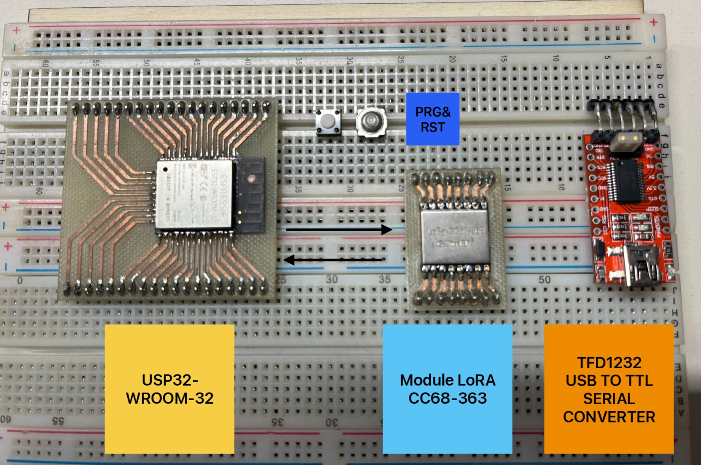

# 📝 Compte Rendu — CEBAN Daniel  
## Séance du 28/11/2025

---

### Recapitulatifs des objectifs
**Objectif 1** : Intégrer le module SIM6000 à l'ESP32, établir une connexion GPRS et valider la liaison par l'envoi d'un SMS à l'utilisateur. Réussi ✅

**Objectif 2**. Simuler la collecte de données de ruche (sur l'ESP32) et les transmettre avec succès à un serveur web via une requête HTTP. Réussi ✅

**Objectif 3**. Câbler un ESP32 (sans le module LoRA) et un module LoRa pour implémenter une fonctionnalité de réveil de l'ESP32 en utilisant seulement le module LoRa. → En cours ⏸️

**Objectif 4**. Finaliser le système ESP32/LoRa en y intégrant le module SIM7000G pour assurer deux fonctions : l'envoi d'alertes par SMS et la transmission des données LoRa vers le serveur web.

**Objectif 5**. Concevoir un circuit imprimé (PCB) dédié intégrant l'ensemble des modules (ESP32, LoRa, SIM) pour consolider le système final d'acquisition et de transmission de données. 

---

## Objectif de la seance 
Câbler un ESP32 (sans le module LoRA) et un module LoRa pour implémenter une fonctionnalité de réveil de l'ESP32 en utilisant seulement le module LoRa.

### Liste des modules 

 

On va utiliser un convertisseur TTL pour communiquer entre le PC et l'ESP32, puis par la suite, on va câbler une communication full-duplex entre le module LoRa et l'ESP32 de sorte que le module LoRa puisse réveiller l'ESP32.

## Etape 1 câblede convertiseur TLL et USP32 

 