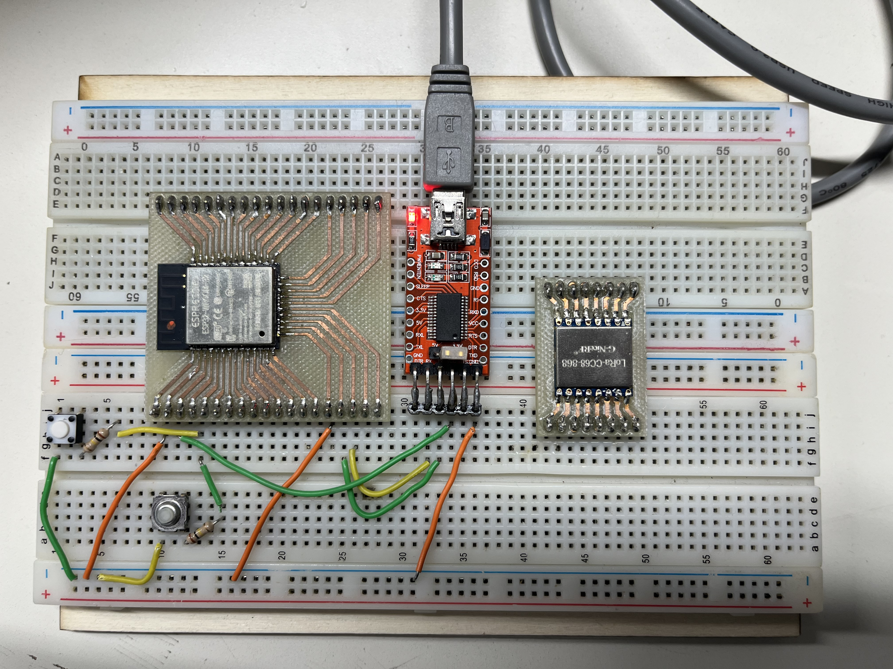
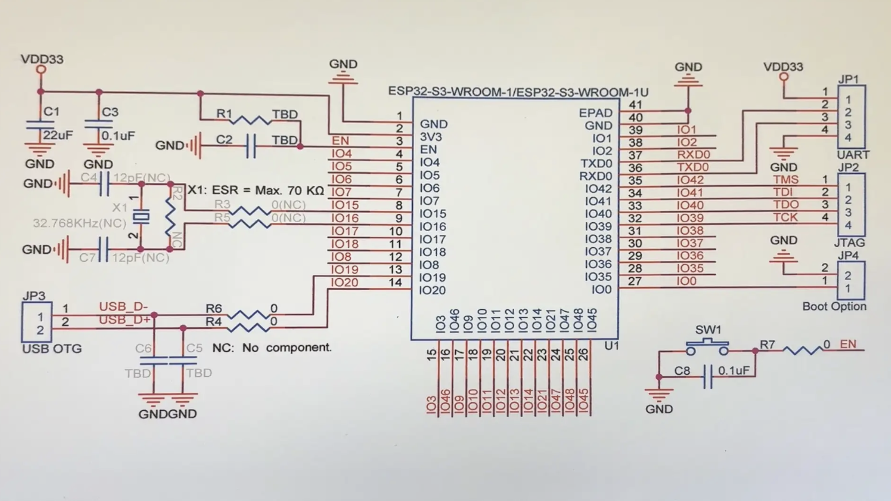
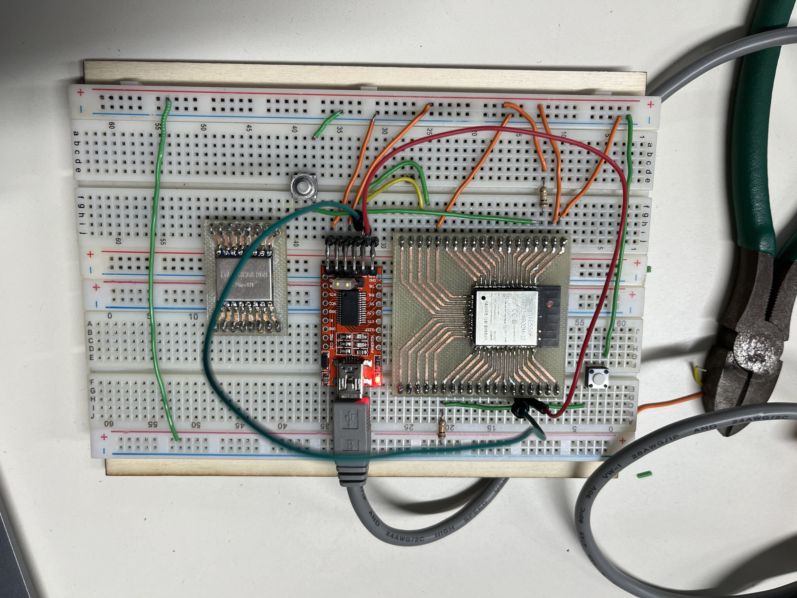

# 📝 Compte Rendu — CEBAN Daniel  
## Séance7  du 11/11/2025 

---
## Objectif de la seance 
Câbler un ESP32 (sans le module LoRA) et un module LoRa pour implémenter une fonctionnalité de réveil de l'ESP32 en utilisant seulement le module LoRa.
---

## Etape 1 Câblage ESP32->PC 
- Le but de cette étape de de verifier la connexion EPS32 -> PC 
- Vefirier le fontionnement de buttons 
- Télécharger un programme sur le ESP32

 

### probleme 

```text
Connecting......................................
A fatal error occurred: Failed to connect to ESP32: No serial data received.
For troubleshooting steps visit: https://docs.espressif.com/projects/esptool/en/latest/troubleshooting.html

Failed uploading: uploading error: exit status 2
````
Explications 
```text
Le bouton "PRG" sur le GPIO 36 c'est une erreur. Le GPIO 36 est une broche d'entrée seulement (Sensor VP), elle ne sert jamais au démarrage.
```

Troubleshoting 
```text
Pour mettre l'ESP32 en mode "Téléchargement" (Download Mode), l'ESP32 regarde l'état de la broche GPIO 0 au moment exact où il démarre.

- Si GPIO 0 est connecté à la masse (GND) au démarrage -> L'ESP32 attend le code (Mode Flash).
- Si GPIO 0 est connecté au 3.3V (HIGH) au démarrage -> L'ESP32 lance le programme (Mode Normal).
```
Si les boutons sont mal câblés (surtout le GPIO 0), l'IDE Arduino n'arrivera jamais à se connecter. Il affichera une erreur du type "Timed out waiting for packet header".

### Cablage correct 


1. Button "RST" :
 - Connecter une résistance de 100kΩ entre EN et 3.3V. (Pour garder la puce allumée par défaut).
 - Connecte ton bouton poussoir entre EN et GND. (Appuyer dessus redémarre la puce).

2. Button "PRG" :
 - Connecte une résistance de 100kΩ entre GPIO 0 et 3.3V.
 - Connecte ton bouton poussoir entre GPIO 0 et GND.

 

### 2 problem RX et TX mouvais câblage


Apres avoir connecte le 2 button on s'est rendu compte qu'on doit utilier le button 
- TX de la pâte 41 du ESP32
- RC de la pâte 40 du ESP32 

Voic le câblage EPS32 nu -> qui marche 

### Bingo !!!
On arrive a télécharger les donnes vers ESP32
```text
Connecting.....
Connected to ESP32 on /dev/cu.usbserial-00000000:
Chip type:          ESP32-D0WDQ6 (revision v1.0)
Features:           Wi-Fi, BT, Dual Core + LP Core, 240MHz, Vref calibration in eFuse, Coding Scheme None
Crystal frequency:  40MHz
MAC:                24:6f:28:20:8f:20

Uploading stub flasher...
Running stub flasher...
```


 

---

## Etape 2 Cabler et connecter le module LORA au ESP32

 


Pour connecter le module LoRa à l'ESP32, nous allons utiliser l'interface SPI (Serial Peripheral Interface).

```text
Serial Peripheral Interface (SPI) is a de facto standard (with many variants) for synchronous serial communication, used primarily in embedded systems for short-distance wired communication between integrated circuits.
```


Alimentation (VCC) : Le module LoRa doit être alimenté en 3.3V (Pin 13). N'utilisez JAMAIS 5V.