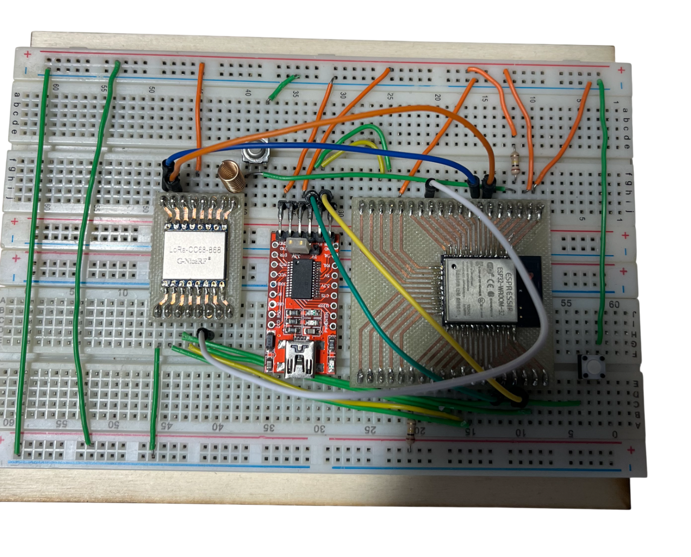

# 📝 Compte Rendu — CEBAN Daniel  
## Séance 9 du 21/01/2026 

---

## Objectif de la séance 
Continuer à cabler la partie LoRa sur le montage et faire une analyse de la continuation du projet.

---

## Etapes de la seance 

### Etape 1 : Finir câblage SPI entre LoRa et EPS32

**Tableau Connexion LoRa -> ESP32 WROOM-32**

| Broche LoRa (Pin Name) | Broche LoRa (N°) | Fonction | Broche ESP32 WROOM-32 (GPIO) | Broche ESP32 (Pin N°) |
|------------------------|------------------|----------|------------------------------|----------------------|
| VCC | 13 | Alimentation | 3.3V (Source d'alimentation régulée) | (À connecter à la même source 3.3V que l'ESP32) |
| GND | 1, 8, 10 | Masse | GND | (Déjà fait) |
| MOSI | 3 | Maître $\rightarrow$ Esclave | GPIO 23 (VSPI_D) | 36 |
| MISO | 2 | Esclave $\rightarrow$ Maître | GPIO 19 (VSPI_Q) | 38 |
| SCK | 4 | Horloge | GPIO 18 (VSPI_CLK) | 34 |
| NSS | 5 | Chip Select (CS) | GPIO 5 (VSPI_CS0) | 31 |

**Tableau des broches de Contrôle**

| Broche LoRa (Pin Name) | Broche LoRa (N°) | Fonction | Broche ESP32 WROOM-32 (GPIO) | Notes |
|------------------------|------------------|----------|------------------------------|-------|
| NRESET | 6 | Reset du module | GPIO 27 | Broche libre courante. |
| DIO1 | 15 | Interruption 1 | GPIO 34 | Broche d'entrée uniquement (parfaite pour les interruptions). |
| BUSY | 16 | État Occupé | GPIO 35 | Broche d'entrée uniquement. |

#### Points importants 

- Le module LoRa doit être alimenté en 3.3V ✅
- connecter une antenne appropriée à la broche ANT (Pin 9) avant la première émission, sinon on risque d'endommager le module.
- dans le code on doit initialiser la bibliothèque LoRa (la librairie SX127x) en spécifiant les numéros de GPIO.

### Etat de câblage actuel 

- VCC - ✅
- GND - ✅
- MOSI - ✅
- MISO - ✅
- SCK - ✅
- NSS - ✅
- NRESET - ✅
- DIO1 - ✅
- BUSY - ✅
- ANT - ✅

## Etape 2 : definir Scénario type de communication

le but etant de déterminer les protocoles et les étapes à suivre dans la suite du projet

1) Collecte locale via LoRa
- Protocole radio: LoRa PHY (EU868)
- Module: Transceiver type SX127x relié en SPI à l'ESP32 (MOSI/MISO/SCK/CS).
- Trame application: JSON compact (ou binaire propriétaire + CRC16) contenant `hive_id`, `temp_c`, `weight_kg`, `rssi`, `timestamp`.

2) Réveil et acquisition sur ESP32
- Énergie: l'ESP32 reste en deep‑sleep entre deux transmissions (objectif µA).
- Réveil: interruption externe via `DIO1` du LoRa sur `GPIO34/35` (entrée seule) → `esp_sleep_enable_ext1_wakeup()`.
- Interfaces internes: SPI (LoRa) pour lire la trame

3) Remontée longue portée via SIM7000G
- Lien MCU↔modem: UART 115200 8N1 (AT commandes) via TinyGSM.
- Attachement réseau: 3GPP (GPRS/EDGE 2G ou LTE Cat‑M1/NB‑IoT si disponible); activation PDP (APN `sl2sfr`).
- Couche IP: IPv4 fournie par le PDP; transport TCP; application HTTP.
- Envoi données: HTTP POST (JSON) vers le serveur cible (ex: `http://rucher.polytech.unice.fr/`).
- Alerte SMS: en alternative ou redondance, envoi SMS (3GPP TS 23.040) via `modem.sendSMS()`.

4) Intégration matérielle (PCB)
- Alimentation: rail modem 4.0 V pour (SIM7000G); rail 3.3 V séparé pour ESP32 + LoRa.
- Découplage: ≥ 470–1000 µF près du SIM7000G + céramiques proches de chaque VCC.
- Commande PWRKEY: transistor/MOSFET piloté par GPIO ESP32; accès test‑points (EN, IO0, RST, TX0/RX0).
- Niveaux logiques: vérifier compatibilité UART du module utilisé; prévoir translation si nécessaire.
- RF: pistes 50 Ω, plans de masse continus, keep‑out sous antennes; connecteurs u.FL/SMA (cellulaire et 868 MHz) + ESD.
- EMI/SE: séparation des retours de courant (modem ↔ logique), via stitching, guidelines de routage SPI/UART.

### Etape 3 : Faire un code test pour véfier si on arrive à communiquer avec LoRa

blocage on n'arrive pas a communiquer avec le ESP32
on va revoir tout la partie câblage

Retour eux étapes initialles 

