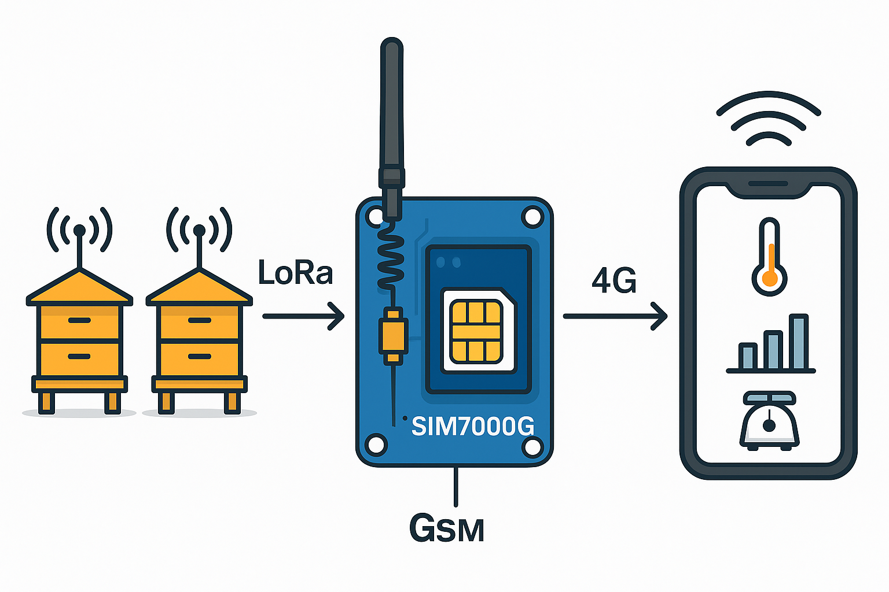
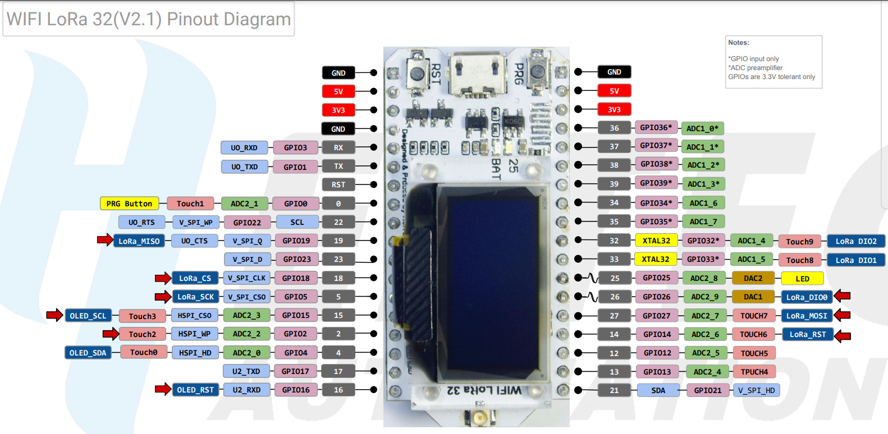

# CR - MIRRIONE Xavier  
## Séance du 04/11/2025  

---

---

### Branchement de l'ESP32 avec le module GSM
- UPLOAD DU CODE, plusieurs bug empêchait son fonctionnement on a du vérifier le branchement.

- le PIN PWRKEY du GSM était connecté au port 3V3 de L'ESP. Une fois que sa deconnection le code à finalement bien fonctionné. La raison des problèmes venait de là, il faudra piloter à l'aide d'un pin GPIO de l'ESP le PWRKEY, pour le moment le laisser à 0 au GND suffit afin d'établir une connexion entre GSM ET ESP32
le code que l'on a upload permet de restart la modem GSM et d'effectuer une lecture des infos de la carte, une fois que tout ça est OK il lui send un msg pour tester le bon reçu.

Le PWRKEY active la carte lorsqu'il est en dessous de son power level de 0,5 V. Lorsqu'il est au dessus il met OFF le module GSM.

Attention lors de la définition des pin GPIO que l'on définira comme TX et RX, il faut utiliser des GPIO O/I libre. Car les GPIO RX et TX du l'uart0 soit 3 et 4 sont généralement utilisés pour le serial avec le PC. Et les deux autres TXD et RDX du UART2 ne peuvent pas être utilisés car OLED_RST sur le Pin 16 du RXD. Ainsi 2 GPIO libres ont été choisis, le pin GPIO23 pour TX et GPIO21 pour RX. 
---
### Prochaines étapes du projet

1. **Prendre en main la partie LoRa**
   - Vérifier le **bon fonctionnement du module LoRa**.  
   - Reprendre et tester le **code source** fourni par l’équipe précédente.  
   - S’assurer que la communication **en émission et réception** fonctionne correctement.
2. **Prise en main du Module GSM**
    - arriver à envoeyr des messages avec une carte SIM
3. **Rélier Lora en utilisant l'ESP32 pour établier une communication avec le GSM**  
    - Integration LoRA & ESP32
    - Ajout du GSM