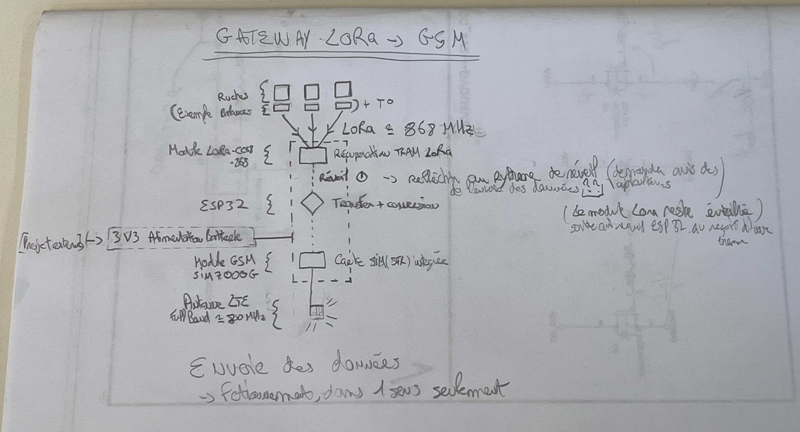
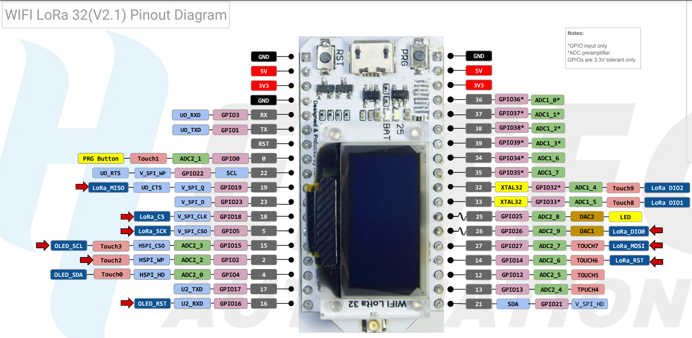

# CR - MIRRIONE Xavier  
## Séance du 22/10/2025  

---

---

### Branchement de l'ESP32 avec le module GSM
- Dans le CR Finale du groupe précédent, ils se sont trompé au niveau du schéma utilisés pour les pins du Heltec Wifi Lora ESP 32.
- Celui dont on utilise est le V2.1, or leur schéma est celui du V3. Même si les pins RX TX reste les mêmes (5 RX - 6 TX)

---

### Prochaines étapes du projet

1. **Prendre en main la partie LoRa**
   - Vérifier le **bon fonctionnement du module LoRa**.  
   - Reprendre et tester le **code source** fourni par l’équipe précédente.  
   - S’assurer que la communication **en émission et réception** fonctionne correctement.
2. **Prise en main du Module GSM**
    - arriver à envoeyr des messages avec une carte SIM
3. **Rélier Lora en utilisant l'ESP32 pour établier une communication avec le GSM**  
    - Integration LoRA & ESP32
    - Ajout du GSM