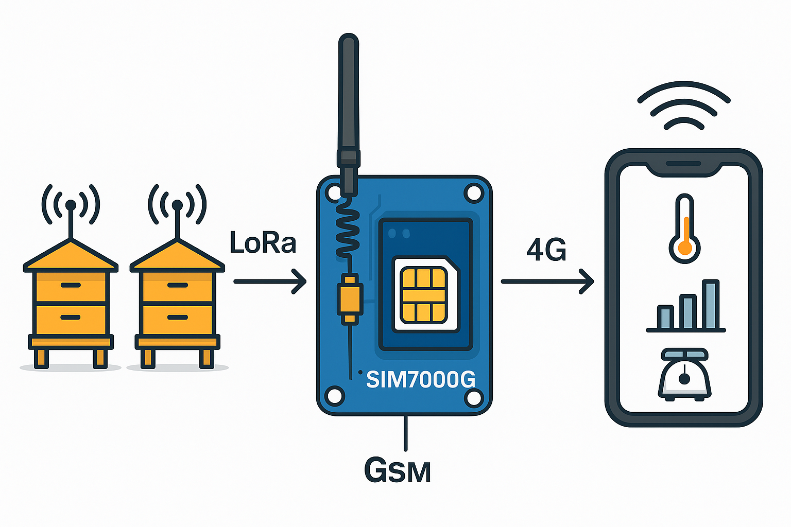

# CR - MIRRIONE Xavier  
## Séance du 27 et 28/11/2025  

---

---

## CONTEXTE
Lors du précedent cours datant du 12 Novembre 2025, Daniel a avancé sur le code afin de faire fonctionner le module GSM. Celui-ci à bien réussi à envoyer des messages SMS à son portable. Et il a aussi pu se connecter au https.

## SUITE 
Procédure de verification pour faire fonctionner le module Lora qui reveillera un ESP32 nue dormant. On doit les connecter et aussi ajouter 2 poussoirs sur une laptop et le module FTD1232 com Série entre notre esp32 et le PC.
Photos ont été prises, maintenant il faut agencer et vérifier leur pin respectifs pour commencer le cablage.    

Mise en place installation d'Eagle Autodesk. Création d'un hub du nom de : Lora, libre d'accès pour les utilisateurs de ayant le même type d'adresse (etu.univ-cotedazur.fr). La version utilisé est une version d'évaluation pour une durée de 30 jours.

Brochage des composants et recherche des pins et Datasheet des composants respects : 

Une flèche est visible sur la face avant du Lora. Celle-ci permet de montrer le pin numéro 1 étant le GND. L'antenne 50 Ohms est le pin 9.

---
### Prochaines étapes du projet

1. **Prendre en main la partie LoRa**
   - Vérifier le **bon fonctionnement du module LoRa**.  
   - Reprendre et tester le **code source** fourni par l’équipe précédente.  
   - S’assurer que la communication **en émission et réception** fonctionne correctement.
2. **Prise en main du Module GSM**
    - arriver à envoeyr des messages avec une carte SIM
3. **Rélier Lora en utilisant l'ESP32 pour établier une communication avec le GSM**  
    - Integration LoRA & ESP32
    - Ajout du GSM