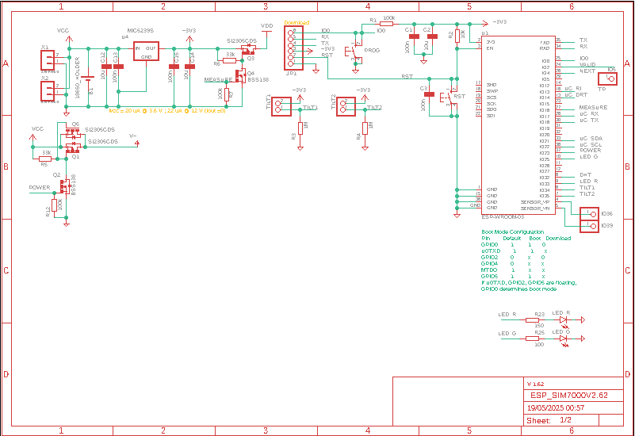

# CR - MIRRIONE Xavier  
## Séance 10 du 03/02/2026  

Installation d'autodesk Eagle sur le PC pour la réalisation schématic de la carte de la gateway.

Voici la première version établie, les deux leds ont été gardées. Il manque encore la photo résistance afin d'avoir le mode jour / nuit.

## Prochainement
- Avancer le schématic = ajouter un sheet pour le SIM7000G
- Définir les pins nécessaires pour le cablage sur la plaque labdec
- Voir et régler le problème dont ils avaient l'ancien groupe avec le LoRa 
