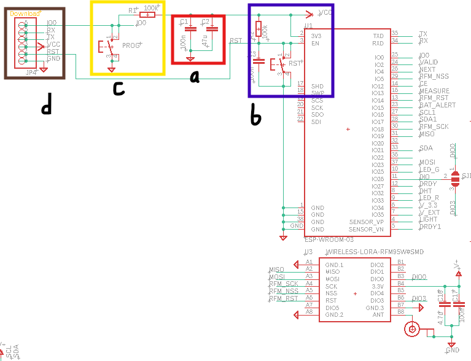

# CR - MIRRIONE Xavier  
## Séance 10 du 03/02/2026  

## Explication du schematic
1. Partie ESP32 nu et LoRa

a) Deux condensateurs de découplage sont placés entre l’alimentation 3,3 V et la masse GND : un 100 nF et un 47 µF. Le grand filtre les parasites haute fréquence et les transitoires rapides au plus près du module, tandis que le 47 µF sert de capacité réservoir pour limiter les chutes de tension lors des pics de courant. 
Ils réduisent l’impédance de l’alimentation et améliorent la stabilité du fonctionnement.

b)La broche EN de l’ESP32 est une entrée hardware d’activation : à l’état haut active le chip, tandis que EN à l’état bas le RESET. 
Pour garantir un démarrage fiable, EN ne doit pas être flottant (en l'air) et doit être validé après stabilisation du 3,3 V. 
On utilise donc un pull-up R2 vers VCC et un condensateur C3 vers la masse formant un RC de temporisation. À la mise sous tension, C3 est initialement déchargé et maintient EN bas brièvement, puis il se charge via R2 et EN monte au niveau haut après un délai de quelques ms. Le bouton RST force EN à 0 V pour réinitialiser manuellement le module et recommencer le processus de charge.

c) La broche IO0 de l’ESP32 est une broche de sélection de mode de boot lue au reset. Une résistance R1 (pull-up) la maintient à l’état haut par défaut afin d’assurer un démarrage normal. Le bouton PROG force IO0 à la masse lorsqu’il est pressé ; si IO0 est maintenu bas pendant un reset, l’ESP32 démarre en mode bootloader UART, ce qui permet le téléversement du programme.

d) Enfin le connecteur JP4 regroupe les signaux nécessaires à la mise au point : TX/RX pour la communication UART (téléversement via bootloader et debug par console série), IO0 pour forcer le mode programmation (BOOT) lorsqu’il est maintenu à 0 durant un reset, RST/EN pour réinitialiser le module, ainsi que VCC et GND pour l’alimentation et la référence de masse. L’interface série doit être utilisée en 3,3 V et les lignes UART sont connectées en croisant TX et RX entre l’adaptateur et la carte.

## Prochainement
- Ajouter un connecteur ou nous pourrons brancher directement le SIM7000G car celui-ci est trop difficile à souder 
- Voir et régler le problème dont ils avaient l'ancien groupe avec le LoRa 
