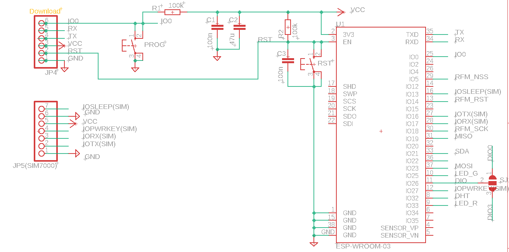
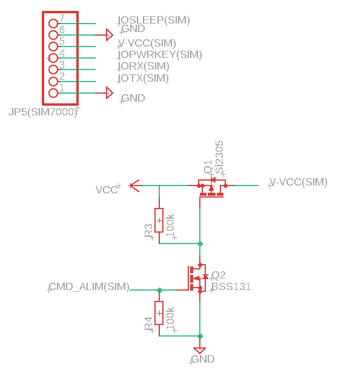

# CR - MIRRIONE Xavier  
## Séance 13 du 05/03/2026  

## Ajustement et modification du schematic
Changement du pin sleep : IO2 à IO13

On a vérifié la documentation du SIM7000G, sa puce est alimentée en 3V3. Il n'est donc pas nécessaire de l'alimentée en 5V car c'est dans un seul cas d'utilisation alimenté via le module USB directement et non les broches/pins. DONC PAS BESOIN DE LEVEL SHIFTER comme l'ancien groupe avait fait. 

Ajout JP5 vers SIM7000G

Dans la Data Sheet, il est spécifié que le mode sleep consomme 1.2 mA. Sur plusieurs heures, c'est conséquent alors afin de réduire sa consommation à zéro lorsqu'il n'est pas utilisé. Un circuit hardware supplémentaire et commandé par une port GPIO supplémentaire de l'ESP32.

Deux transistors Mosfets : 
- NMOS : BSS 131
- PMOS : SI2305

- réalisation du schéma : 

