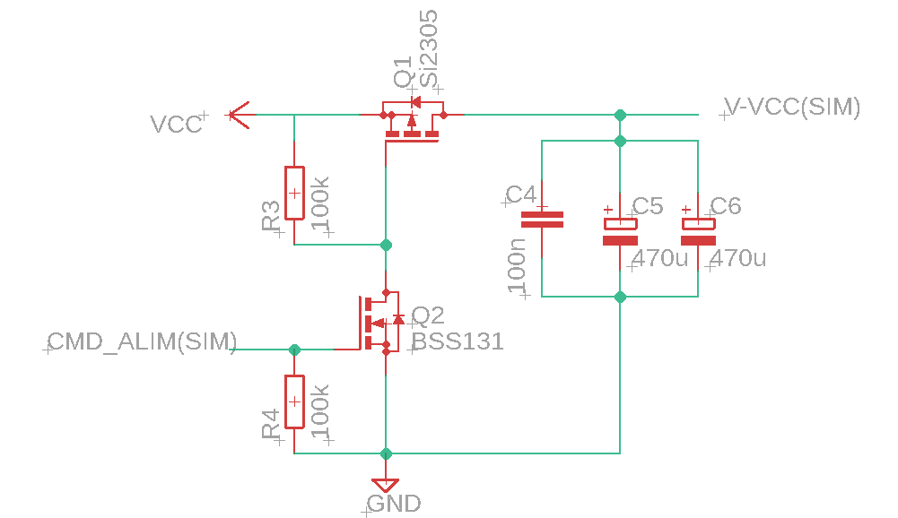
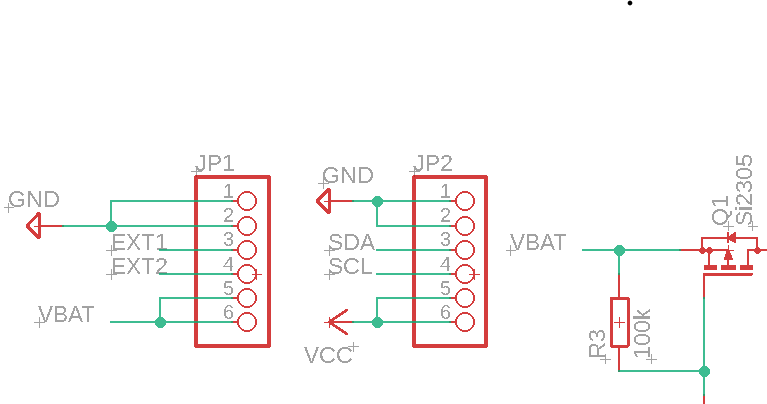

# CR - MIRRIONE Xavier  
## Séance 14 du 17/03/2026  

## Finalisation du schematic

- réalisation du schéma : 

Trois condensateurs de découplage ont été ajoutés pour le VCC du module SIM7000 afin d’assurer sa stabilité. Le condensateur de 100 nF filtre les perturbations haute fréquence, tandis que les deux condensateurs de 470 µF servent de réserve d’énergie pour absorber les pics de courant importants générés lors des transmissions. Ils permettent ainsi de limiter les chutes de tension transitoires et d’éviter les dysfonctionnements du module pour le protéger.

Afin d'accepter la futur présence de la batterie dans la cadre d'un jointement entre ce projet et le notre, les deux connecteurs JP1 et JP2 ont été réliés. 

Réalisation du schematic est terminée à 100%. Désormais il faut passer à la réalisation de la board tout en respectant certaines conditions qui seront détaillées lors du prochain rapport. 
