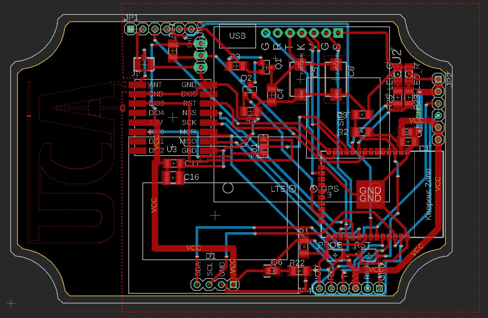

# CR - MIRRIONE Xavier  
## Séance 17 du 10/04/2026  

## Routage de la carte
Le routage est terminé ! Tout à été ajusté dont la taille des routes, à 50 mils et non 50 mm. (50 mils = 1,27mm) 

De nombreuses contraintes ont du être respectés, notammement la proximité des condensateurs afin d'éviter toutes perturbation et stabilité de la tension de l'esp32. Mais encore le Lora proche de l'antenne. 

Le projet Eagle va être envoyé au professeur. Il effectuera le plan de masse, et la commande sera faite. D'ici le prochain cours (24 Avril 2026) nous allons pouvoir peut être recevoir la carte PCB. 

Nous réflechissons. Il ne reste que 2 séances il va falloir préparer la soutenance ainsi que le rapport.
Le routage et le schematic vont devoir être ajoutés au dépot github du projet Gateway Lora-GSM.

Les pins doivent être vérifiés avec ceux utilisés expérimentalement par mon camarade. Il n'a fait fonctionné les deux modules qu'individuellement pour le moment et non ensemble.

### Prochainement 
