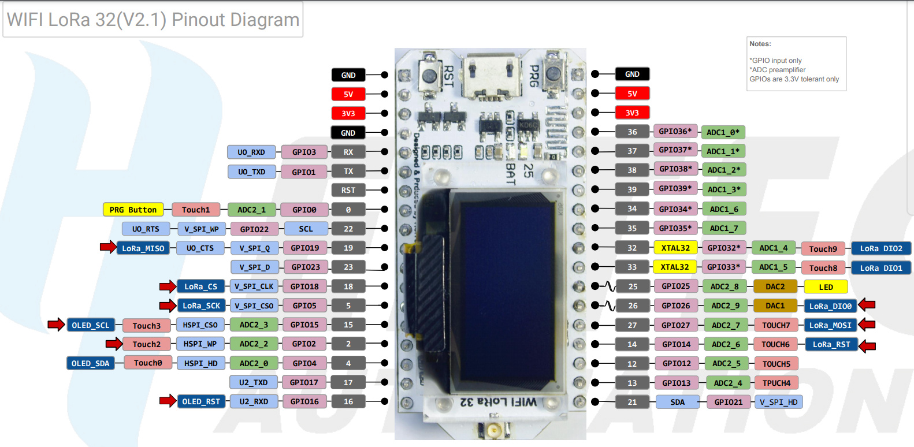
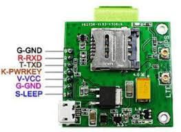

# CR - MIRRIONE Xavier  
## Séance du 22/10/2025  

## CONTEXTE

Lors de la séance précédante, un schéma a été dessiné afin de mieux appréhender et comprendre le projet LoRa-GSM. Le principe du projet est le suivant : 

1. Le module **LoRa-CC68-868**, fonctionnant à 868 MHz, sera le seul composant à garder un état éveillé. 
2. Réception d'une TRAME LoRa (température de la ruche, poids de la ruche), il réveillera l'ESP32.
3. L'**ESP32** se chargera de la conversion des données reçues.Ces données seront transférées au **Module GSM SIM7000G**.
4. Le module GSM avec **carte SIM** intégrée, se chargera d'envoyer des données et informations à l'agriculteur sur son téléphone via une **antenne LTE** Full band 800 MHz.

Notre projet répond à ce principe de fonctionnement, dans un seul sens seulement. Et à cette nécessité de recevoir les informations et mesures des ruches en temps réel en GSM, via téléphone portable.

L'alimentation globale du système sera en 3V3. Un projet externe, annexe au autre, appartenant à un autre groupe est la confection d'une alimentation, batterie. Permettant ainsi à notre projet de se rendre portable.  
 

### 1. Branchement de l'ESP32 avec le module GSM SIM7000G
- Dans le CR Finale du groupe précédent, ils se sont trompé au niveau du schéma utilisés pour les pins du Heltec Wifi Lora ESP 32.

- Celui dont on utilise est le V2.1, or leur schéma est celui du V3. Même si les pins RX TX reste les mêmes (5 RX - 6 TX)

  

- Le branchement des pins Rx et Tx est fait de manière croisée. Tx to Rx de l'un et l'autre. Non Tx to Tx / Rx to Tx.  

### Prochaines étapes à faire lors de la prochaine séance 
- Finaliser le branchement des deux modules, le PWRKEY n'a pas été branché, des recherches appronfondies doivent être faite sur son principe de fonctionnement.
- Téleverser et faire fonctionner le code de l'ancien groupe.