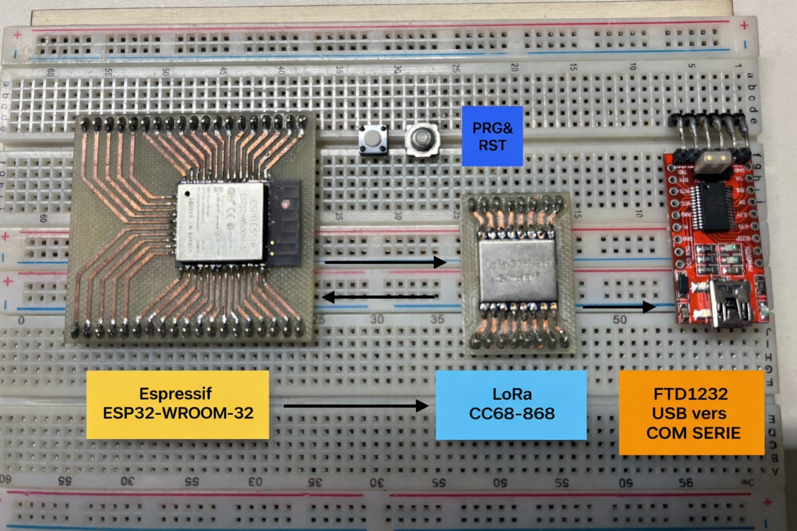

# CR - MIRRIONE Xavier  
## Séance 5 du 27/11/2025  

## CONTEXTE
Lors du précedent cours, en mon absence datant du 12 Novembre 2025, Daniel a avancé sur le code afin de faire fonctionner le module GSM. Celui-ci à bien réussi à envoyer des messages SMS à son portable. Et il a aussi pu se connecter au lien https.

### Recapitulatifs des objectifs
**Objectif 1** : Câblage du module SIM7000G à l'ESP32 Heltec, Vérficiation du code et téléversement. Approfondisement et recherche du module GSM. Réussi ✅

**Objectif 2** : Câblage ESP32 nue et module LoRaCC68-868 pour implémenter une fonctionnalité de réveil de l'ESP32 en utilisant seulement le module LoRa. → En cours ⏸️

**Objectif 3** : Finaliser le système général de la platforme en y intégrant le module SIM7000G pour assurer deux fonctions : l'envoi d'alertes par SMS et la transmission des données LoRa vers le serveur web.

**Objectif Final** : Une fois notre platforme entière de faite et fonctionnelle, il faudra réflechir à la conception d'un circuit imprimé (PCB). Intégrant l'ensemble des modules (ESP32, LoRa, SIM) pour consolider le système final d'acquisition et de transmission de données. 

## Branchement ESP32 Nue au module LoRa CC68-868 
Procédure de verification pour faire fonctionner le module Lora qui reveillera un ESP32 nue dormant. On doit les connecter et aussi ajouter 2 poussoirs sur une laptop et le module FTD1232 convertisseur Usb vers Com Série entre notre ESP32 et le PC.
Désormais, il faut agencer la disposition, vérifier les pins respectifs pour commencer le cablage.    

- Mise en place et installation d'Eagle Autodesk. Création d'un hub du nom de : Lora, libre d'accès pour les utilisateurs de ayant le même type d'adresse (etu.univ-cotedazur.fr). La version utilisé est une version d'évaluation pour une durée de 30 jours. L'installation a été compliquée, le logiciel dont nous avons besoin est désormais compris dans un pack général de chez Eagle. Beaucoup de temps perdu, au final ce n'est pas superbe. Pour le moment ce logiciel est mis de côté. 

### Prochaine séance 
- Il faut se concentrer sur le brochage des composants et la recherche des pins et des Datasheet des composants