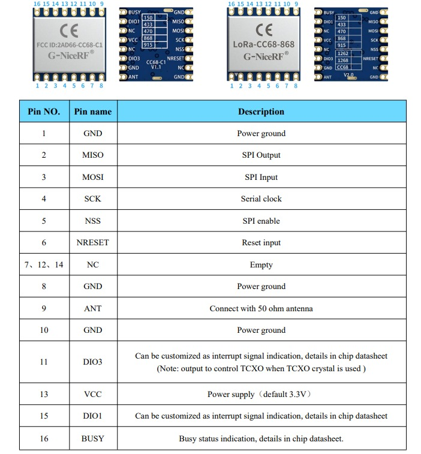
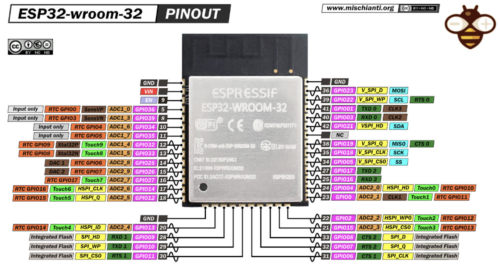
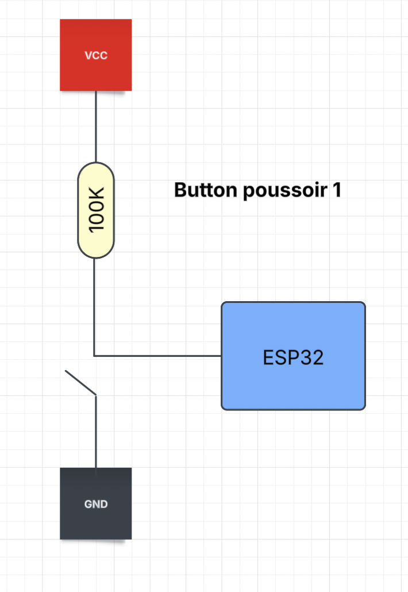

# CR - MIRRIONE Xavier  
## Séance du 28/11/2025  

## CONTEXTE

Cette séance est consacrée à la lecture de la datasheet du module **LoRa CC68-868**, ainsi qu’à l’identification des interfaces nécessaires à son intégration avec le microcontrôleur **ESP32-WROOM-32** et un adaptateur série **FTDI1232**.  
L’objectif est de comprendre le rôle des différentes broches avant toute finalisation du câblage matériel.

## SUITE

### Lecture des broches via la datasheet du Module LoRa CC68-868

Le module **LoRa CC68-868** est un transceiver radio fonctionnant dans la bande ISM 868 MHz.  
L’orientation du composant est indiquée par une flèche présente visible sur sa face supérieure. Cette flèche permet d’identifier la position du **PIN 1**, correspondant à la **masse (GND)**. Cette information est essentielle afin d’éviter toute erreur d’orientation ou de selection d'un pin lors du câblage. 
L’architecture du module repose principalement sur une **interface SPI**, accompagnée de signaux de contrôle et d’interruption.

#### Alimentation
- **VCC (pin 13)** : alimentation principale du module, avec une tension nominale de **3,3 V**
- **GND (pins 1, 8 et 10)** : masses du module

#### Interface de communication (SPI)
- **MISO (pin 2)** : sortie SPI du module
- **MOSI (pin 3)** : entrée SPI du module
- **SCK (pin 4)** : horloge SPI
- **NSS (pin 5)** : sélection du périphérique SPI  
  La mise à l’état bas de NSS marque le début de la communication, et le retour à l’état haut marque la fin.

#### Signaux de contrôle
- **NRESET (pin 6)** : réinitialisation matérielle du module
- **BUSY (pin 16)** : indication d’occupation interne du transceiver
- **DIO1 (pin 15) et DIO3 (pin 11)** : broches configurables, généralement utilisées comme lignes d’interruption

#### Broches spécifiques RF
- **ANT (pin 9)** : connexion de l’antenne radio (impédance 50 Ω)

À ce stade, la datasheet indique que le module présente une faible consommation en réception et en veille. Cela laisse envisager, pour la suite du projet, l’utilisation d’un mode basse consommation côté ESP32, avec un réveil déclenché par une interruption LoRa (DIO1).

---

### Association des pins LoRa CC68 avec l’ESP32-WROOM-32

Le microcontrôleur **ESP32-WROOM-32** dispose de GPIO compatibles avec les liaisons SPI. Les GPIO6 à GPIO11 (SPI Interne) ne sont pas recommandés pour un usage utilisateur. Il faut donc choisir en HSPI et VSPI.

Les broches suivantes de l’ESP32 sont identifiées comme **compatibles SPI** :
- **GPIO23** : MOSI
- **GPIO19** : MISO
- **GPIO18** : SCK
- **GPIO5**  : CS (NSS)
Les signaux de contrôle du module LoRa (BUSY, DIO1, DIO3, NRESET) seront reliés à des GPIO quelconque de l’ESP32, configurés en entrée ou sortie selon le besoin logiciel.  

---

### Schéma de câblage du bouton poussoir

Un bouton poussoir est utilisé comme interface utilisateur avec l’ESP32.  
Le schéma de câblage repose sur une **résistance de pull-up externe de 100 kΩ**, reliant l’entrée GPIO à la tension **VCC**.

- À l’état repos, l’entrée est maintenue à un niveau logique haut.
- Lors de l’appui, l’entrée est reliée à la **masse (GND)**, ce qui force un niveau logique bas.

Ce type de câblage permet :
- d’éviter les états indéterminés de l’entrée,
- de garantir une lecture fiable de l’état du bouton,
- de simplifier le traitement logiciel côté microcontrôleur.

Ce montage permet d’éviter les états indéterminés et garantit une lecture fiable de l’état du bouton par le microcontrôleur.

---

### Prochaine séance
- Lecture approfondie de la datasheet complète du module LoRa CC68-868.
- Finalisation du câblage entre l’ESP32 et le PC via l’adaptateur série.