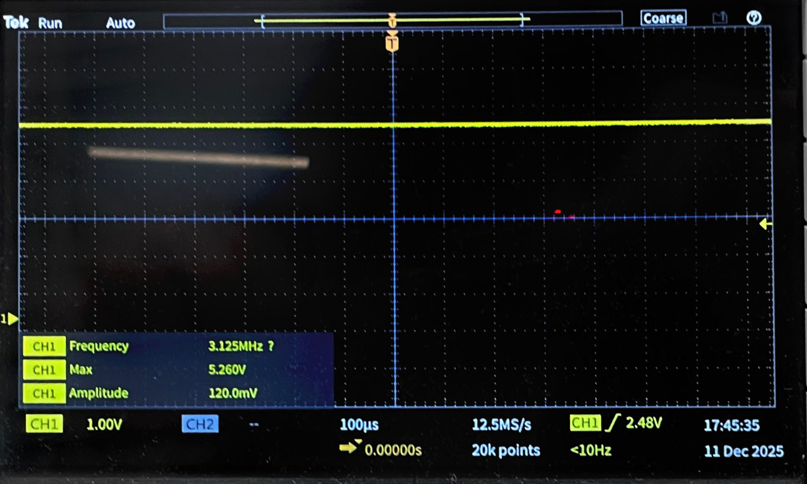
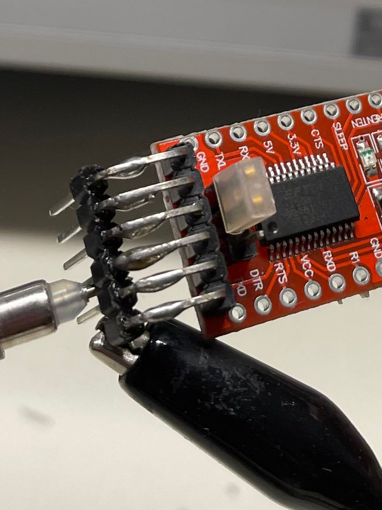
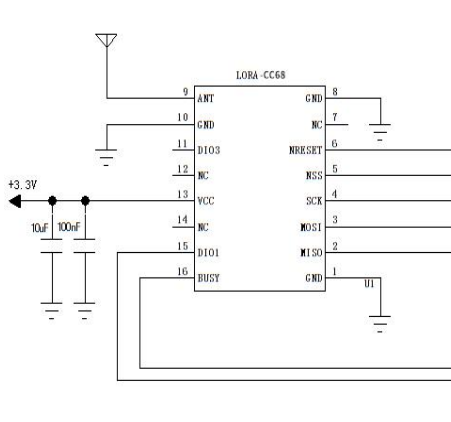

# CR - MIRRIONE Xavier  
## Séance 7 du 11/12/2025  

## CONTEXTE
Le cablage entre les 3 composants suivant a avancé lors cette séance : 
- Tout d'abord il faut vérifier si la connection et le flash de code est possible entre le micro usb board et l'esp32 nu. 

## SUITE 
### Cablage du Serial adaptateur
Le Serial adaptateur module 5V et 3V3 possède 3 pins à coté du MCU permettant de choisir l'un des deux niveaux de tension, pour cela un petit bloc plastique permet de mettre en d'envoyer par le pin central à VCC ce dont on souhaite utiliser comme niveau de tension, afin de vérifier ça, une sonde oscilloscope va être utilisée.
Comme vous pouvez le remarquer, il y a bien 5V. Pour des réseaux de cybersécurité, la mesure à l'oscilloscope n'a pas été screen via le plug d'une clé usb.
Le module fonctionnera en 3V3 afin d'alimenter nos composants. 
 

### Cablage du LoRaCC68-868-G
Ce Lora a quelques particularités dont il va falloir approfondir lors du prochain cours ou bien à la maison. Notamment l'antenne 50 Ohms reliée au pin 9, celle-ci sera filaire pour donc 868 MHz. Pour se faire il faut calculer sa longueur d'onde soit Lambda = C / F. Avec c la celerité c = 3.10E8 m/s et F= 868.10E6 Hz. Donc Lambda vaut 0.345m soit 34,5 cm. Nous allons respecter le principe d'adaptation d'impédence à l'aide du principe du quart d'onde comme longueur de l'anntenne filaire, soit 1/4*34,5cm = 8,625 cm. 
Ensuite il y a un autre point dont il faut faire attention au Lore, un condensateur de 10µF + 100 nF est nécesaire entre VCC et GND comme on le voit dans le schéma dans la partie *5.Typical application circuit* de la datasheet.

