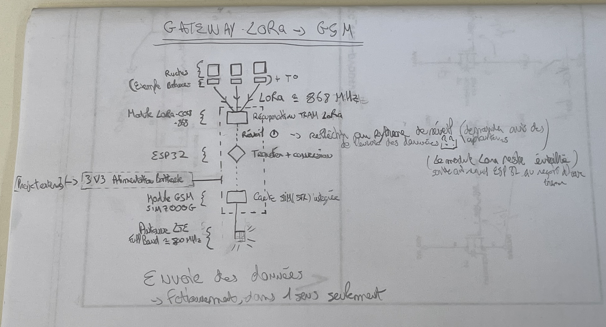
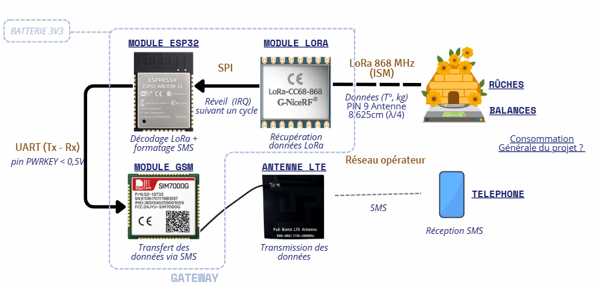

# CR - MIRRIONE Xavier  
## Séance 8 du 20/01/2026  

## CONTEXTE
Cette séance est la veille de l'oral, pour mieux s'y préparer une refonte totale de l'explication et de la compréhension du projet a été faite. Pour ainsi dire un bilan synthétique de tout ce dont nous avons mis en place de puis la première séance. 

## SCHEMA EXPLICATIF 
### Mise en forme
Tout à été fait à partir du schéma sur papié initialement fait.  

voici la version transformé.
