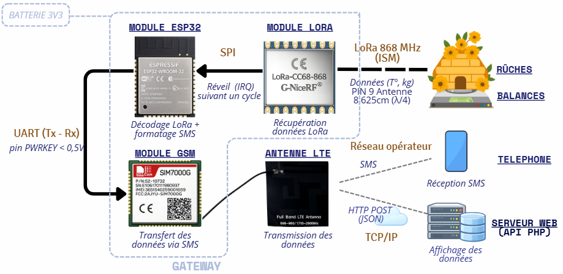

# CR - MIRRIONE Xavier  
## Séance 9 du 21/01/2026  

## CONTEXTE
L'après-midi suite à l'oral, quelques modifications doivent avoir lieu sur le schéma du projet. 
### Modification
Il manquait la partie HTTP avec la serveur swep où seront directement affiché les données.
