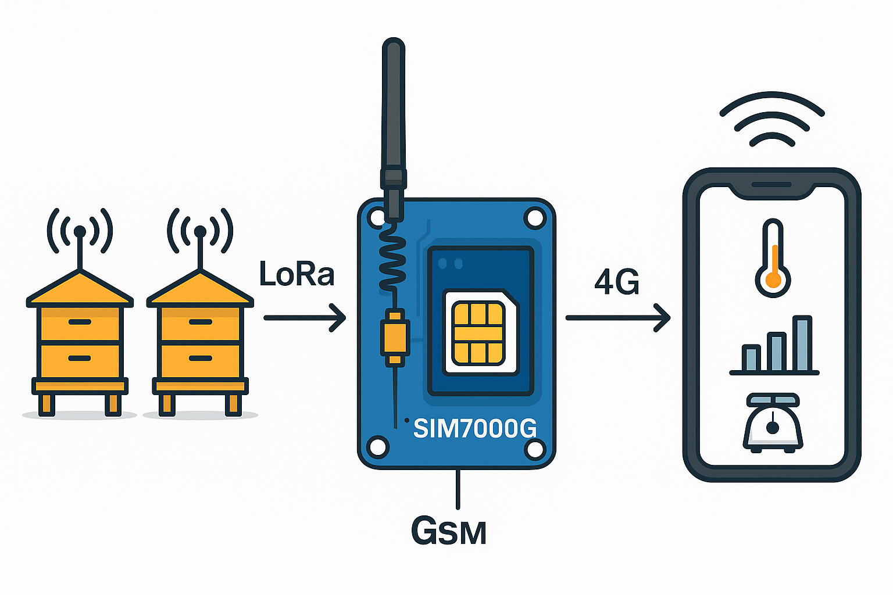

# 🐝 Ruche Connectée – Passerelle LoRa ↔ GSM

Projet réalisé dans le cadre du **cours de Projet d'Électronique** à **Polytech Nice Sophia Antipolis**,  
encadré par **M. Christian Peter** (*Christian.PETER@univ-cotedazur.fr*).

**Groupe :**  
- CEBAN Daniel — [ceban.daniel@etu.univ-cotedazur.fr] 
- MIRRIONE Xavier  — [mirrione.xavier@etu.univ-cotedazur.fr]

---

## 🎯 Objectif du projet

Ce projet vise à concevoir une **ruche connectée** capable de :

- Collecter et transmettre à distance des données environnementales ;  
- Communiquer via une **passerelle LoRa ↔ GSM** ;  
- Intégrer des fonctions avancées comme **l’élimination des parasites par laser**.

Cette partie du projet se concentre sur **la communication à distance** des données.

---

## Dossiers :
- 📁 CompteRendu_Daniel
- 📁 CompteRendu_Xavier
- 📁 Partie_Electronique
- 📁 Partie_Informatique

---

## GLOSSAIRE :

- GSM (Global System for Mobile Communications) :
C'est un standard de communication mobile utilisé pour la téléphonie cellulaire et la transmission de données. Il permet l’envoi de messages SMS, les appels et la connexion à Internet via GPRS/EDGE/3G/4G. Le GSM est largement utilisé pour les dispositifs IoT nécessitant une connectivité dans des environnements sans Wi-Fi.

- LoRa (Long Range) :
C'est une technologie de communication sans fil à longue portée et à faible consommation d'énergie, utilisée pour connecter des dispositifs IoT aux réseaux LPWAN (Low Power Wide Area Network). LoRa permet de transmettre de petits paquets de données sur de longues distances (jusqu'à 15 km en zones rurales) avec une consommation d’énergie minimale.

- ESP32 :
C'est un microcontrôleur développé par Espressif, intégrant Wi-Fi et Bluetooth, ainsi que plusieurs broches GPIO pour les capteurs et modules externes. Il est largement utilisé dans les projets IoT grâce à sa connectivité, sa puissance et son faible coût.
Il va nous permetre de récuperer les information des LoRa et les envoier vers le module GSM pour ensuite transmettre les information au utilisateur.

- SIM7000 :
C'est un module de communication GSM/GPRS/NB-IoT/LTE Cat-M1 développé par Simcom. Il permet aux dispositifs IoT d'envoyer et de recevoir des données via les réseaux mobiles, en prenant en charge les connexions basse consommation, idéales pour les capteurs distants et les applications de surveillance.

---

## 🧩 Technologies utilisées

- **ESP32** – Microcontrôleur principal du système.  
- **SIM7000G** – Module GSM / NB-IoT / LTE pour la communication mobile.  
- **LoRa** – Communication longue portée et faible consommation.  
- **TinyGSM** – Bibliothèque facilitant la communication série avec le SIM7000G.

---

## ⚙️ Fonctionnement général

1. Initialisation et configuration du modem GSM (SIM7000G).  
2. Connexion au réseau mobile via **APN SFR** (`sl2sfr`).  
3. Transmission ou test d’envoi de données / SMS.  
4. Préparation à l’intégration de la communication **LoRa** pour la collecte distante.  

---

## Etapes du projet 

### 🚧 Etape 1:
- Analyse du projet existant et definier les tacher pour continuer le projet. Repartition des taches dans le groupe 

---

## 💡 Référence du projet précédent

Ce projet est basé sur le travail de la promotion précédente :  
**Oumar Sadjo Barry** & **Mor Dieng** – *RucherLoRa*  
- Guilherme Ventapane Rodrigues — [guilherme@ventapane.eu](mailto:guilherme@ventapane.eu)  
- Jarod Lecoeuvre — [jarod.lecoeuvre@etu.univ-cotedazur.fr](mailto:jarod.lecoeuvre@etu.univ-cotedazur.fr)

---

## 🧠 Encadrant

**M. Christian Peter**  
_Enseignant – Département Électronique & Informatique Industrielle_  
[Christian.PETER@univ-cotedazur.fr](mailto:Christian.PETER@univ-cotedazur.fr)
